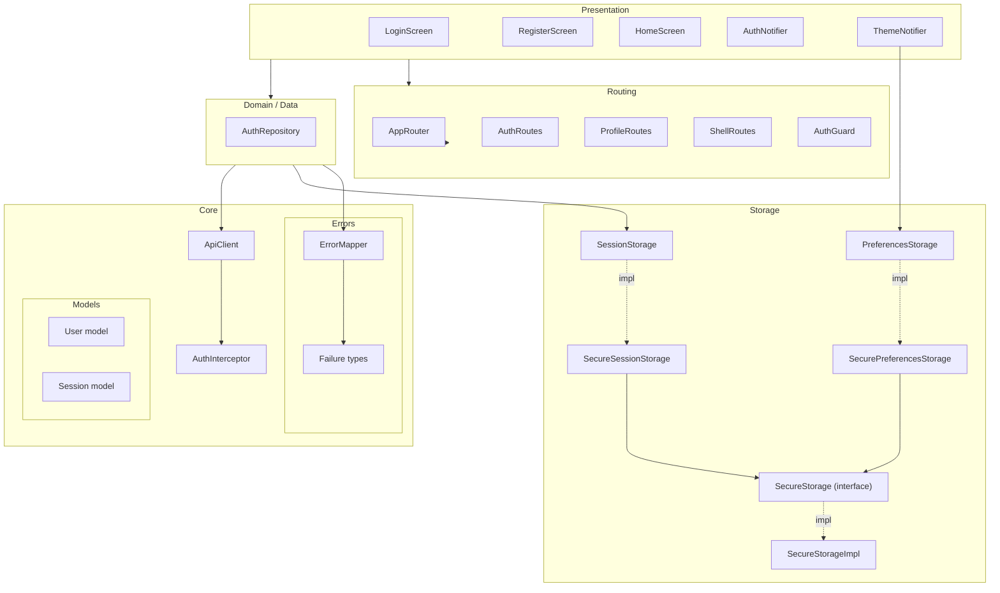
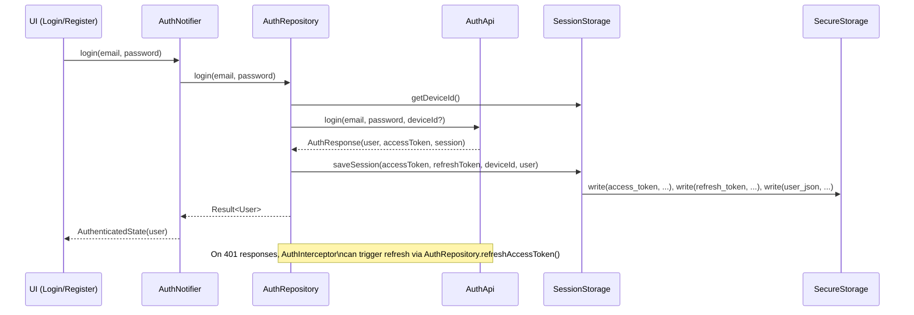

# Flutter Frontend Boilerplate

Production-ready Flutter application boilerplate with clean architecture, authentication, and modern UI components.

## Features

- **Clean architecture**: Feature-based folder structure with clear separation of concerns.
- **Authentication**: Full auth flow with JWT, refresh tokens, session restore, and guards.
- **State management**: Provider + `ChangeNotifier` (`AuthNotifier`, `ThemeNotifier`).
- **Routing**: GoRouter with auth guards and optional shell layout — see [`docs/Routing.md`](docs/Routing.md).
- **Theme system**: Design tokens, light/dark mode, ThemeNotifier — see [`docs/ThemeProvider.md`](docs/ThemeProvider.md).
- **User & error model**: Typed user model and failure/exception pipeline — see [`docs/User.md`](docs/User.md) and [`docs/ErrorHandling.md`](docs/ErrorHandling.md).
- **Storage layer**: Modular storage for session & preferences — see [`docs/Storage.md`](docs/Storage.md).
- **UI components**: Atomic design (atoms, molecules, organisms) and reusable shell layout.

---

## Architecture Overview



Bu şema, ayrıntıları `docs/*.md` altındaki dokümanlarda anlatılan katmanların birbirleriyle ilişkisini özetler.

---

## Development Setup (Dev Environment)

### Prerequisites

- **Flutter SDK**: latest stable
- **Dart SDK**: 3.9+
- **Backend API**: varsayılan olarak `http://localhost:3000`

### Clone & Install

```bash
git clone https://github.com/batuyilmazer/flutter-frontend-boilerplate
cd flutter-frontend-boilerplate
flutter pub get
```

### Configure API (Dev)

Varsayılan backend URL’si:

- Dosya: `lib/core/config/app_config.dart`
- Alan: `AppConfig.apiBaseUrl`

```dart
class AppConfig {
  const AppConfig._();

  /// Base URL for the backend API.
  ///
  /// In a real project, consider using flavors or `--dart-define` to override
  /// this per environment (dev, staging, prod).
  static const String apiBaseUrl = 'http://localhost:3000';
}
```

Geliştirme ortamında:

- Backend lokalde çalışıyorsa bu değer çoğu durumda yeterlidir.
- Farklı bir dev/staging ortamı kullanıyorsanız bu sabiti ilgili URL ile güncelleyebilirsiniz.

### Run (Dev)

```bash
flutter run
```

Bu komut:

- `main.dart` üzerinden uygulamayı başlatır,
- `AppRouter.createRouter(context)` ile routing’i,
- `AuthNotifier` ve `ThemeNotifier` ile auth/theme state’ini hazırlar.

---

## Production Setup (Build & Config)

### Configure API (Prod)

Prod ortamında, backend URL’sini production endpoint’inize ayarlayın:

1. `lib/core/config/app_config.dart` içindeki `apiBaseUrl` değerini prod URL’nizle değiştirin:
   ```dart
   static const String apiBaseUrl = 'https://api.yourdomain.com';
   ```
2. Alternatif olarak, gerçek projede Flutter **flavors** veya `--dart-define` ile environment bazlı config kullanabilirsiniz (yorum satırındaki notlara bakın ve kendi projenizde uygularsınız).

> Not: Bu boilerplate, basitlik için tek bir `AppConfig` sınıfı ile gelir; environment spesifik yapılandırmayı kendi projelerinizde genişletebilirsiniz.

### Build Commands

Mobil:

```bash
# Android
flutter build apk --release

# iOS (Xcode / ipa için)
flutter build ios --release
```

Web:

```bash
flutter build web --release
```

Desktop (opsiyonel, platform desteğine göre):

```bash
flutter build macos --release
flutter build windows --release
flutter build linux --release
```

Prod deploy öncesi:

- `AppConfig.apiBaseUrl` değerinin production backend’i işaret ettiğinden,
- Authentication/refresh akışının prod backend’de düzgün çalıştığından emin olun.

---

## Project Structure (lib/)

```text
lib/
├── main.dart                    # Entry point; providers, router, theme
├── core/                        # Shared infrastructure (config, errors, models, network, storage)
├── features/                    # Feature modules (auth, profile, etc.)
├── routing/                     # GoRouter setup and route definitions
├── theme/                       # Theme data, notifier, design tokens
└── ui/                          # Reusable UI components (atoms/molecules/organisms/layout)
```

Detaylar:

- **Routing**: Ayrıntılı routing ve shell mimarisi için [`docs/Routing.md`](docs/Routing.md).
- **Theme**: Tema token’ları, ThemeNotifier ve migration rehberi için [`docs/ThemeProvider.md`](docs/ThemeProvider.md).
- **User**: User modeli, JSON parsing helper’ları ve extensions için [`docs/User.md`](docs/User.md).
- **Error Handling**: Exception → Failure mapping ve Result tipi için [`docs/ErrorHandling.md`](docs/ErrorHandling.md).
- **Storage**: Secure storage, session ve preferences katmanları için [`docs/Storage.md`](docs/Storage.md).

---

## Core Modules (High-Level)

Bu bölüm, detaylı dokümanlara hızlı bir giriş niteliğindedir. Ayrıntı için ilgili `docs/*.md` dosyalarına bakın.

### Routing (`lib/routing/`)

- `AppRouter.createRouter(context, { RoutingMode mode = RoutingMode.plain })` ile GoRouter kurulumu.
- `AuthGuard` ile login zorunluluğu ve auth sayfalarından redirect.
- `AuthRoutes`, `ProfileRoutes`, `ShellRoutes` ile modüler route tanımı.
- Shell layout (bottom nav, `MainShell`) ve yeni feature ekleme rehberi için [`docs/Routing.md`](docs/Routing.md).

### Theme (`lib/theme/`)

- `AppThemeData` (Freezed) + scheme’ler (colors/typography/spacing/radius).
- `ThemeNotifier` ile `ThemeMode` state yönetimi ve kalıcı tema tercihleri.
- `ThemeBuilder` + `AppThemeData.toThemeData()` ile Material `ThemeData` üretimi.
- UI tarafında `BuildContext` extension’ları ile token erişimi — detay için [`docs/ThemeProvider.md`](docs/ThemeProvider.md).

### User & Auth (`lib/core/models/user/`, `lib/features/auth/`)

- `User` modeli backend Prisma şemasına uyumludur; JSON parsing helper’ları `user_json.dart` içindedir.
- `AuthApi` login/register/refresh/logout/getMe endpoint’lerini kapsar.
- `AuthRepository` token & session yönetimini `SessionStorage` ile birleştirir.
- Auth state yönetimi (`AuthNotifier`, `AuthState`) ve UI akışı için [`docs/User.md`](docs/User.md) ve [`docs/ErrorHandling.md`](docs/ErrorHandling.md) dokümanlarına bakın.

### Storage (`lib/core/storage/`)

- `SecureStorage` / `SecureStorageImpl`: generic, platform-aware key–value storage.
- `StorageKeys`: tüm storage anahtarlarının merkezi tanımı.
- `SessionStorage` / `SecureSessionStorage`: access/refresh token, deviceId ve `User`’ın saklanması.
- `PreferencesStorage` / `SecurePreferencesStorage`: `ThemeMode` ve gelecekteki kullanıcı tercihleri.
- Tasarım detayları ve genişletme rehberi için [`docs/Storage.md`](docs/Storage.md).

---

## Authentication & Storage Flow



Bu diyagramın alt katman detayları için:

- User modeli ve JSON helper’ları: [`docs/User.md`](docs/User.md)
- Error/Failure akışı: [`docs/ErrorHandling.md`](docs/ErrorHandling.md)
- Storage katmanı: [`docs/Storage.md`](docs/Storage.md)

---

## Documentation Index

| Konu | Dosya |
|------|-------|
| Routing (modüler yapı, guards, shell, yeni route/feature) | [`docs/Routing.md`](docs/Routing.md) |
| Theme provider & design tokens | [`docs/ThemeProvider.md`](docs/ThemeProvider.md) |
| User modeli, JSON parsing, extensions | [`docs/User.md`](docs/User.md) |
| Error & exception handling, Result tipi | [`docs/ErrorHandling.md`](docs/ErrorHandling.md) |
| Storage & session architecture | [`docs/Storage.md`](docs/Storage.md) |

---

## Additional Resources

- [Flutter Documentation](https://docs.flutter.dev/)
- [GoRouter](https://pub.dev/packages/go_router)
- [Provider](https://pub.dev/packages/provider)
- [Clean Architecture](https://blog.cleancoder.com/uncle-bob/2012/08/13/the-clean-architecture.html)

