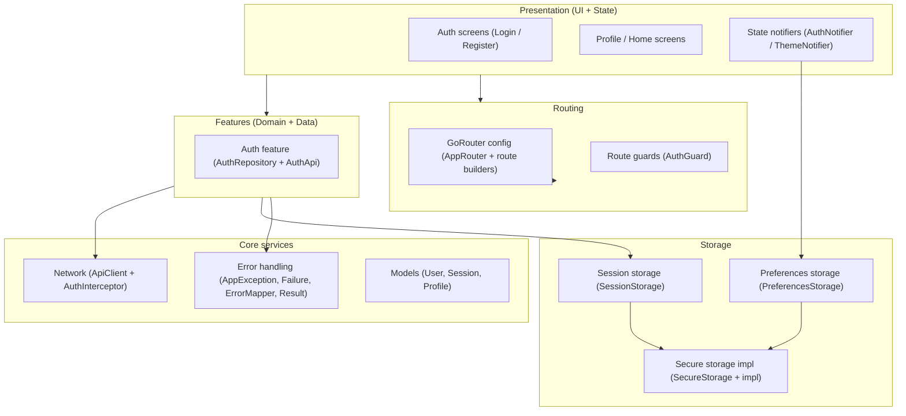
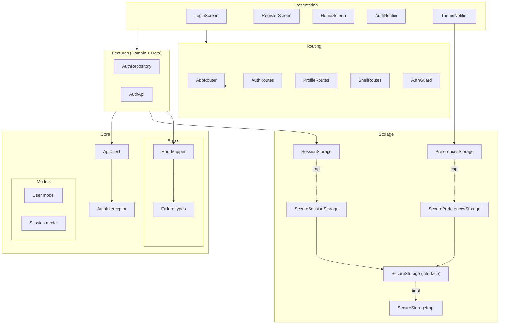
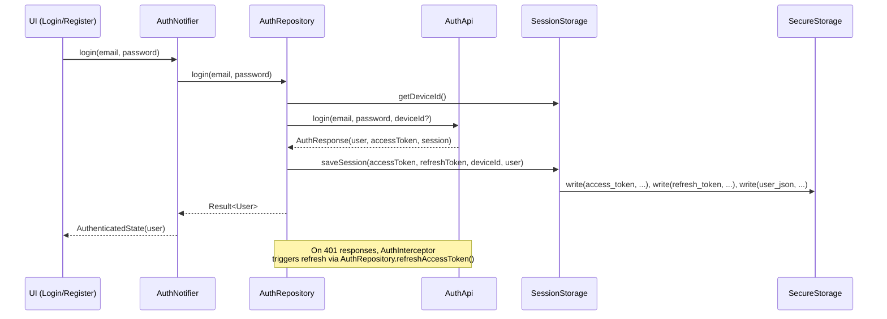

# Flutter Frontend Boilerplate

Production-ready Flutter application boilerplate with clean architecture, authentication, and modern UI components.

## Features

- **Clean architecture**: Feature-based folder structure with clear separation of concerns.
- **Authentication**: Full auth flow with JWT, refresh tokens, session restore, and guards.
- **State management**: Provider + `ChangeNotifier` (`AuthNotifier`, `ThemeNotifier`).
- **Routing**: GoRouter with auth guards and optional shell layout.
- **Theme system**: Design tokens (colors, typography, spacing, radius, sizes, shadows), light/dark mode, ThemeNotifier.
- **Error handling**: Typed exception/failure pipeline with `Result<T>`.
- **Storage layer**: Modular secure storage for session and preferences.
- **UI components**: Atomic design (atoms, molecules, organisms) and reusable shell layout.
- **Network layer**: Centralized API client with auth interceptor.

---

## Architecture Overview

Bu bölümde mimariyi iki seviyede gösteriyoruz:

- **Yüksek seviye (kavramsal)**: Yeni başlayanların akışı hızlıca anlaması için.
- **Detaylı seviye (teknik)**: Sınıf ve modül bazında bağımlılıkları görmek isteyenler için.

### High-level architecture



### Detailed architecture



---

## Getting Started

### Prerequisites

- **Flutter SDK**: latest stable
- **Dart SDK**: 3.9+
- **Backend API**: defaults to `http://localhost:3000`

### Clone & Install

```bash
git clone https://github.com/batuyilmazer/flutter-frontend-boilerplate
cd flutter-frontend-boilerplate
flutter pub get
```

### Configure API

The default backend URL lives in `lib/core/config/app_config.dart`:

```dart
class AppConfig {
  const AppConfig._();

  static const String apiBaseUrl = 'http://localhost:3000';
}
```

- For local development this default is usually sufficient.
- For production, change it to your production endpoint or use Flutter flavors / `--dart-define` for environment-specific configuration (see [Config docs](docs/en/Config.md)).

### Run

```bash
flutter run
```

This launches the app through `main.dart`, sets up routing via `AppRouter.createRouter(context)`, and initializes `AuthNotifier` and `ThemeNotifier`.

---

## Build for Production

```bash
# Android
flutter build apk --release

# iOS
flutter build ios --release

# Web
flutter build web --release

# Desktop (optional)
flutter build macos --release
flutter build windows --release
flutter build linux --release
```

Before deploying, ensure `AppConfig.apiBaseUrl` points to your production backend and that the auth/refresh flow works against it.

---

## Project Structure

```text
lib/
├── main.dart           # Entry point; providers, router, theme
├── core/               # Shared infrastructure (config, errors, models, network, storage)
├── features/           # Feature modules (auth, profile, etc.)
├── routing/            # GoRouter setup and route definitions
├── theme/              # Theme data, notifier, design tokens
└── ui/                 # Reusable UI components (atoms/molecules/organisms/layout)
```

---

## Authentication & Storage Flow



---

## Documentation

Docs are bilingual: English (`docs/en/`) and Turkish (`docs/tr/`).

If you are new to the repository, start with these (in order):

1. **Theme system & tokens** -- [ThemeProvider.md](docs/en/ThemeProvider.md)
2. **UI component system** -- [UI.md](docs/en/UI.md)
3. **Routing (GoRouter + guards + shell)** -- [Routing.md](docs/en/Routing.md)
4. **Storage (session + preferences)** -- [Storage.md](docs/en/Storage.md)
5. **Error handling (Exception / Failure / Result)** -- [ErrorHandling.md](docs/en/ErrorHandling.md)
6. **User model module** -- [User.md](docs/en/User.md)

Core platform docs:

| Topic | EN | TR |
|-------|----|----|
| Auth flow & session management | [Auth.md](docs/en/Auth.md) | [Auth.tr.md](docs/tr/Auth.tr.md) |
| Network layer (ApiClient & interceptors) | [Network.md](docs/en/Network.md) | [Network.tr.md](docs/tr/Network.tr.md) |
| Configuration & environments | [Config.md](docs/en/Config.md) | [Config.tr.md](docs/tr/Config.tr.md) |
| Testing guide | [Testing.md](docs/en/Testing.md) | [Testing.tr.md](docs/tr/Testing.tr.md) |
| Theme provider & design tokens | [ThemeProvider.md](docs/en/ThemeProvider.md) | [ThemeProvider.tr.md](docs/tr/ThemeProvider.tr.md) |
| UI component system | [UI.md](docs/en/UI.md) | [UI.tr.md](docs/tr/UI.tr.md) |
| Routing | [Routing.md](docs/en/Routing.md) | [Routing.tr.md](docs/tr/Routing.tr.md) |
| Storage & session architecture | [Storage.md](docs/en/Storage.md) | [Storage.tr.md](docs/tr/Storage.tr.md) |
| Error & exception handling | [ErrorHandling.md](docs/en/ErrorHandling.md) | [ErrorHandling.tr.md](docs/tr/ErrorHandling.tr.md) |
| User model & JSON parsing | [User.md](docs/en/User.md) | [User.tr.md](docs/tr/User.tr.md) |

Documentation style guide: [STYLE.md](docs/en/STYLE.md) | [STYLE.tr.md](docs/tr/STYLE.tr.md)

---

## Additional Resources

- [Flutter Documentation](https://docs.flutter.dev/)
- [GoRouter](https://pub.dev/packages/go_router)
- [Provider](https://pub.dev/packages/provider)
- [Clean Architecture](https://blog.cleancoder.com/uncle-bob/2012/08/13/the-clean-architecture.html)
