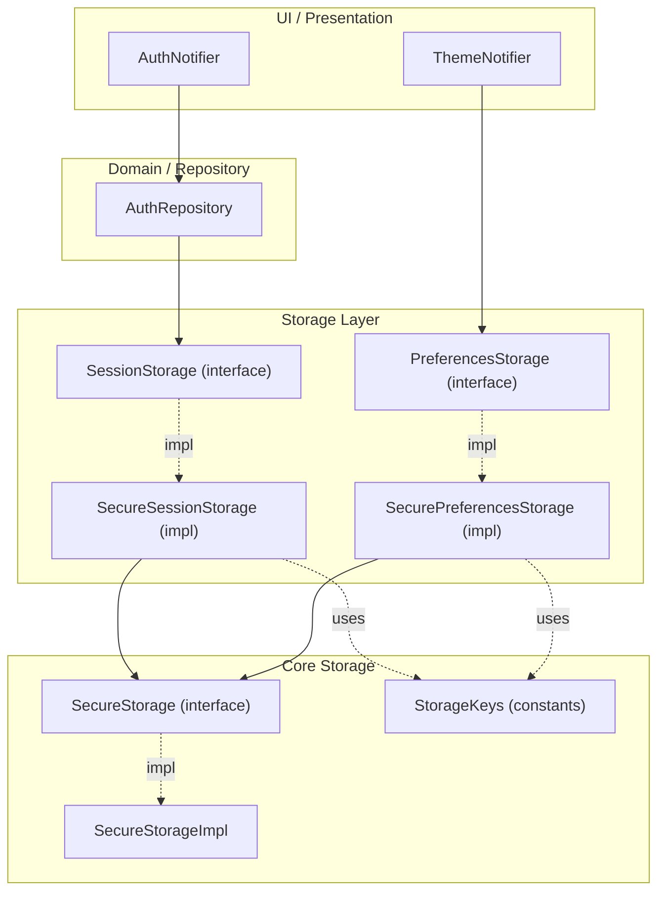
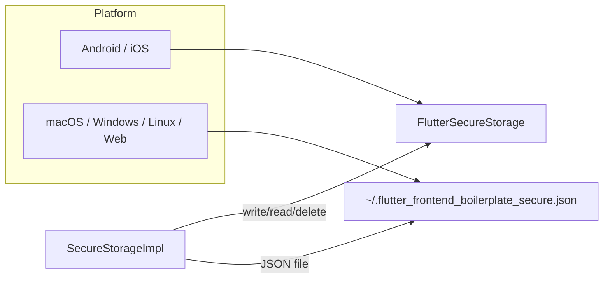
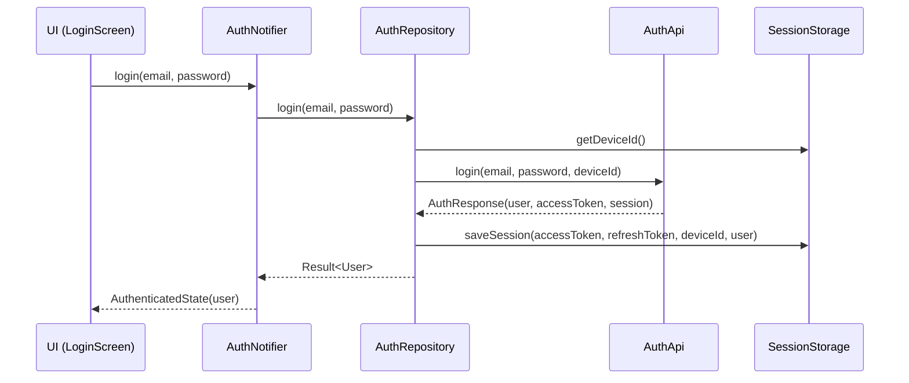
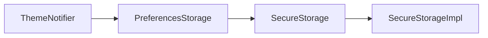
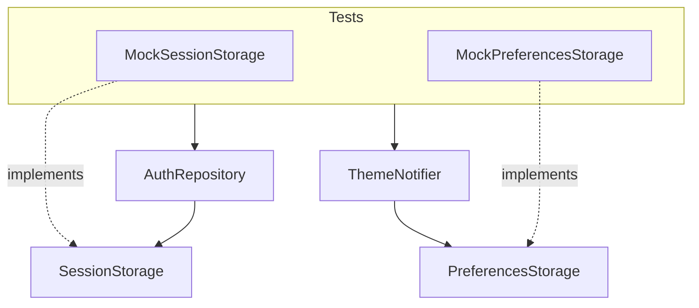

## Storage & Session Architecture

Bu doküman, projedeki **kalıcı veri saklama** mimarisini ve özellikle:

- `SecureStorage` (generic key–value storage),
- `SessionStorage` (auth/session verisi),
- `PreferencesStorage` (kullanıcı tercihleri, tema vb.)

katmanlarının nasıl konumlandığını açıklar. Amaç:

- Storage ile ilgili **sorumlulukları modülerleştirmek**,
- Token / session / user serileştirmesini tek yerde toplamak,
- Hem test edilebilir hem de farklı platform/storage implementasyonlarına kolay uyarlanabilir bir yapı sunmaktır.

---

## Dosya Yapısı

```text
lib/core/storage/
├── secure_storage.dart            // Generic key-value storage interface
├── secure_storage_impl.dart       // Platform aware implementation (secure/file)
├── storage_keys.dart              // Tüm storage key sabitleri
├── session_storage.dart           // Auth/session persistence interface
├── session_storage_impl.dart      // SecureSessionStorage: SessionStorage + SecureStorage
├── preferences_storage.dart       // User preferences interface (ThemeMode vb.)
└── preferences_storage_impl.dart  // SecurePreferencesStorage: PreferencesStorage + SecureStorage
```

Genel kullanımda bu katmanlar, üst seviye bileşenler tarafından doğrudan değil, **repository / notifier** üzerinden tüketilir:

- `AuthRepository` → `SessionStorage`
- `ThemeNotifier` → `PreferencesStorage`

---

## Yüksek Seviye Mimari

Storage mimarisinin üst seviye görünümü:



Özet:

- **Core katman** (`SecureStorage`, `SecureStorageImpl`, `StorageKeys`), platform ve fiziksel storage detaylarını kapsar.
- **Storage katmanı** (`SessionStorage`, `PreferencesStorage`), domain-level kavramlarla (token, user, ThemeMode) konuşur.
- **Domain / UI katmanı** storage’ın nasıl çalıştığını değil, yalnızca **ne saklandığını** bilir.

---

## SecureStorage: Generic Anahtar–Değer Katmanı

**Dosya:** `lib/core/storage/secure_storage.dart`

```dart
/// Thin abstraction over secure key-value storage.
///
/// This is only an interface. In the concrete implementation you can
/// use `flutter_secure_storage` or any other secure mechanism.
abstract class SecureStorage {
  Future<void> write(String key, String value);

  Future<String?> read(String key);

  Future<void> delete(String key);
  
  /// Delete all stored keys.
  Future<void> deleteAll();

  /// Read all stored key-value pairs.
  Future<Map<String, String>> readAll();
}
```

### Tasarım Notları

- **Amaç**: Platformdan bağımsız, minimal bir key–value API sağlamak.
- Token, user veya ThemeMode gibi domain kavramlarından **habersizdir**.
- Hem mobil (Keychain / Keystore) hem de desktop/web (dosya tabanlı fallback) için tek bir arayüz sunar.

### SecureStorageImpl

**Dosya:** `lib/core/storage/secure_storage_impl.dart`

Öne çıkan özellikler:

- Mobilde `flutter_secure_storage`, desktop/web’de basit bir **JSON dosyası** fallback’i kullanır.
- `deleteAll` ve `readAll` ile:
  - Logout gibi durumlarda storage temizliği,
  - Debug amaçlı tüm key’leri inceleme imkanı sağlar.
- Auth veya tema gibi special case’ler bu sınıftan kaldırılmış, sadece generic operasyonlar kalmıştır.



Bu sayede:

- Testler ve üst katmanlar sadece `SecureStorage` arayüzüne bakar,
- Platform/IO detayları tek yerde izole edilir.

---

## StorageKeys: Tüm Anahtarların Merkezi

**Dosya:** `lib/core/storage/storage_keys.dart`

```dart
/// Centralized keys used for secure storage.
class StorageKeys {
  const StorageKeys._();

  // Auth / session
  static const accessToken = 'access_token';
  static const refreshToken = 'refresh_token';
  static const deviceId = 'device_id';
  static const user = 'user_json';

  // App preferences
  static const themeMode = 'theme_mode';
}
```

Tasarım amacı:

- Key string’lerini **magic string** olmaktan çıkarıp, tek yerde toplamak.
- Hem `SessionStorage` hem de `PreferencesStorage` aynı sabitleri kullanır.
- Backend ile anlaşmalar (key isimleri) değişirse, sadece bu dosya güncellenir.

---

## SessionStorage: Auth & Session Persistence

**Dosya:** `lib/core/storage/session_storage.dart`

```dart
import '../models/user/models.dart';

/// Abstraction for persisting and loading authentication/session data.
///
/// This sits on top of [SecureStorage] and exposes domain-level concepts
/// such as access token, refresh token, device id and current user.
abstract class SessionStorage {
  Future<void> saveSession({
    required String accessToken,
    required String refreshToken,
    required String deviceId,
    required User user,
  });

  Future<String?> getAccessToken();
  Future<String?> getRefreshToken();
  Future<String?> getDeviceId();

  Future<User?> getUser();
  Future<void> saveUser(User user);

  /// Returns true if there is enough data to consider a session present.
  Future<bool> hasSession();

  /// Clears all session-related data (tokens, device id, user).
  Future<void> clearSession();
}
```

### SecureSessionStorage Implementasyonu

**Dosya:** `lib/core/storage/session_storage_impl.dart`

`SecureSessionStorage`, `SecureStorage` üzerinde session ile ilgili tüm mantığı toplar:

- Token ve cihaz id’sini saklar,
- `User` modelini JSON olarak serileştirir,
- Session varlığını (`hasSession`) kontrol eder,
- Logout/expire durumlarında tüm session verisini temizler.

```dart
class SecureSessionStorage implements SessionStorage {
  SecureSessionStorage({SecureStorage? storage})
      : _storage = storage ?? SecureStorageImpl();

  final SecureStorage _storage;

  @override
  Future<void> saveSession({
    required String accessToken,
    required String refreshToken,
    required String deviceId,
    required User user,
  }) async {
    await _storage.write(StorageKeys.accessToken, accessToken);
    await _storage.write(StorageKeys.refreshToken, refreshToken);
    await _storage.write(StorageKeys.deviceId, deviceId);
    await saveUser(user);
  }

  // ...
}
```

### AuthRepository ile Veri Akışı

**Dosya:** `lib/features/auth/data/auth_repository.dart`

`AuthRepository`, network katmanından (`AuthApi`) gelen yanıtları **SessionStorage** ile birleştirir:

- `register` / `login`:
  - `AuthResponse` alır,
  - `saveSession` ile access token, refresh token, deviceId ve user’ı saklar.
- `refreshAccessToken`:
  - Stored refresh token + deviceId ile yeni token alır,
  - Gerekirse `/me` ile user’ı yenileyip `saveSession` çağırır.
- `restoreSession`:
  - Storage’dan access token’ı okur,
  - `/me` endpoint’i ile valid user doğrulaması yapar,
  - Başarılıysa user’ı günceller, değilse `clearSession`.



Bu yapı sayesinde:

- Token ve user saklama/okuma mantığı **tek sınıfta** (`SecureSessionStorage`) toplanır,
- `AuthRepository` sadece domain flow’larına odaklanır,
- Gelecekte farklı session stratejileri (memory-only, farklı storage vs.) kolayca eklenebilir.

---

## PreferencesStorage: Kullanıcı Tercihleri (Tema vb.)

**Dosya:** `lib/core/storage/preferences_storage.dart`

```dart
import 'package:flutter/material.dart';

/// Abstraction for persisting and loading user preferences.
///
/// Keeps the rest of the app independent from concrete key names
/// and underlying storage implementation.
abstract class PreferencesStorage {
  Future<ThemeMode?> getThemeMode();

  Future<void> saveThemeMode(ThemeMode mode);
}
```

### SecurePreferencesStorage Implementasyonu

**Dosya:** `lib/core/storage/preferences_storage_impl.dart`

```dart
class SecurePreferencesStorage implements PreferencesStorage {
  SecurePreferencesStorage({SecureStorage? storage})
      : _storage = storage ?? SecureStorageImpl();

  final SecureStorage _storage;

  @override
  Future<ThemeMode?> getThemeMode() async {
    final saved = await _storage.read(StorageKeys.themeMode);
    if (saved == null) return null;

    return ThemeMode.values.firstWhere(
      (e) => e.name == saved,
      orElse: () => ThemeMode.light,
    );
  }

  @override
  Future<void> saveThemeMode(ThemeMode mode) async {
    await _storage.write(StorageKeys.themeMode, mode.name);
  }
}
```

Bu katmanın sorumluluğu:

- Key adlarını (`theme_mode`) ve değer serileştirmesini (`ThemeMode.name`) kapsüllemek,
- Üst katmanlara sadece `ThemeMode` ile konuşan basit bir API sunmak.

### ThemeNotifier ile Entegrasyon

**Dosya:** `lib/theme/theme_notifier.dart`

`ThemeNotifier`, artık doğrudan `SecureStorage` yerine **`PreferencesStorage`** kullanır:

- Başlangıçta `getThemeMode` ile var olan tercih okunur,
- `setThemeMode` / `toggleTheme` çağrılarında `saveThemeMode` ile tercih kalıcı hale getirilir.



Bu, tema ile ilgili tüm kalıcılık mantığını diğer storage senaryolarından ayırır ve ileride:

- Dil tercihi,
- Bildirim tercihleri,
- Onboarding tamamlama durumu

gibi ek **preferences** türleri için aynı pattern’in kullanılmasına izin verir.

---

## Uygulama Giriş Noktasında DI (main.dart)

**Dosya:** `lib/main.dart`

Uygulama ayağa kalkarken:

- Tek bir `SecureStorageImpl` örneği oluşturulur,
- Bu örnek hem `SecureSessionStorage` hem de `SecurePreferencesStorage` tarafından paylaşılır,
- `AuthNotifier` ve `ThemeNotifier` bu storage katmanlarıyla enjekte edilir.

Bu, storage ile ilgili tüm bağımlılıkların **tek noktadan** kablolandığı yerdir.

---

## Test Edilebilirlik

Yeni mimari, testler için bilinçli olarak interface tabanlı tasarlandı:

- `SessionStorage` ve `PreferencesStorage` arayüzleri kolayca **mock/fake** edilebilir.
- Örneğin `ThemeNotifier` testlerinde:
  - `MockPreferencesStorage` kullanılarak tema tercihleri memory’de tutulur,
  - Dosya/secure storage IO’su testlerden tamamen soyutlanır.
- Auth flow testlerinde:
  - `SessionStorage` için in-memory bir implementasyon,
  - `AuthApi` için mock client kullanarak login/refresh/restore akışları izole edilebilir.



Bu yaklaşım:

- Storage ile ilgili side-effect’leri testlerden uzak tutar,
- Logic testlerini hızlı, deterministik ve platformdan bağımsız hale getirir.

---

## Yeni Özellikler İçin Genişletme Rehberi

Yeni bir persistent özellik eklemek istediğinizde (ör. “remember me” flag’i, locale, onboarding state):

1. **Storage anahtarını belirle**
   - `StorageKeys` içine yeni bir sabit ekleyin:
     ```dart
     static const locale = 'locale';
     static const onboardingCompleted = 'onboarding_completed';
     ```

2. **Uygun storage katmanını seç**
   - Auth/session ile ilgiliyse → `SessionStorage`
   - Kullanıcı tercihi ise → `PreferencesStorage`
   - Bambaşka bir domen ise (ör. offline cache), yeni bir interface oluşturmayı düşünün (`CacheStorage` vb.).

3. **Interface’e metod ekle (gerekirse)**
   - Örneğin locale için:
     ```dart
     abstract class PreferencesStorage {
       // ...
       Future<Locale?> getLocale();
       Future<void> saveLocale(Locale locale);
     }
     ```

4. **Concrete implementasyonu güncelle**
   - `SecurePreferencesStorage` içinde ilgili `read/write` mantığını ekleyin.

5. **Yukarıdaki katmana adapter yaz**
   - Örneğin `LocaleNotifier` benzeri bir notifier veya mevcut bir notifier’a yeni bir alan/metot ekleyerek bu storage API’sini kullanın.

Bu pattern:

- Storage ile ilgili tüm değişiklikleri **tek yerde toplayarak**,
- Domain ve UI katmanlarını storage detaylarından izole eder,
- Boilerplate’inizi farklı projelerde tekrar kullanılabilir kılar.

