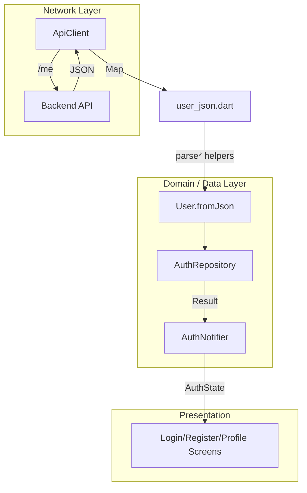

## User Modülü

User modülü, authentication ile doğrudan ilişkili **çekirdek kullanıcı modelini** (`User`) ve ona bağlı yardımcı yapıları kapsar. Amaç:

- Backend Prisma şemasına **bire bir uyumlu**, tip güvenli bir `User` modeli sağlamak,
- Backend’teki JSON alan isimleri ve tutarsızlıkları (`id` vs `userId` gibi) merkezi bir yerde çözmek,
- User ile ilgili tüm tipleri tek bir barrel dosya üzerinden import edilebilir hale getirmek.

---

## Dosya Yapısı

```text
lib/core/models/user/
├── models.dart          // Barrel export
├── user.dart            // Çekirdek User modeli (freezed)
├── user_extensions.dart // User için computed properties
├── user_json.dart       // JSON parsing helper’ları (id/email/flag/datetime)
├── profile.dart         // Profil bilgileri (extensible)
├── profile.freezed.dart // Generated (freezed) - otomatik
├── profile.g.dart       // Generated (json_serializable) - otomatik
└── user.freezed.dart    // Generated (freezed) - otomatik
```

Genel kullanım için:

```dart
import 'package:flutter_frontend_boilerplate/core/models/user/models.dart';
```

Böylece `User`, `Profile`, extension’lar ve JSON helper’ları tek import ile erişilebilir olur.

---

## User Modeli

`lib/core/models/user/user.dart`

```dart
/// User model aligned with backend Prisma schema.
/// Parsing handles backend inconsistencies (userId vs id) via [user_json.dart].

import 'package:freezed_annotation/freezed_annotation.dart';

import 'user_json.dart';

part 'user.freezed.dart';

@freezed
class User with _$User {
  const User._();

  const factory User({
    required String id,
    required String email,
    @Default(false) bool emailVerified,
    @Default(false) bool isSuspended,
    DateTime? lastLoginAt,
    DateTime? createdAt,
    DateTime? updatedAt,
  }) = _User;

  factory User.fromJson(Map<String, dynamic> json) {
    return User(
      id: parseUserId(json),
      email: parseEmail(json),
      emailVerified: parseBool(json, 'emailVerified'),
      isSuspended: parseBool(json, 'isSuspended'),
      lastLoginAt: parseDateTime(json['lastLoginAt']),
      createdAt: parseDateTime(json['createdAt']),
      updatedAt: parseDateTime(json['updatedAt']),
    );
  }
}

/// toJson (Freezed does not generate it when using custom fromJson).
extension UserJsonExtension on User {
  Map<String, dynamic> toJson() => <String, dynamic>{
        'id': id,
        'email': email,
        'emailVerified': emailVerified,
        'isSuspended': isSuspended,
        if (lastLoginAt != null) 'lastLoginAt': lastLoginAt!.toIso8601String(),
        if (createdAt != null) 'createdAt': createdAt!.toIso8601String(),
        if (updatedAt != null) 'updatedAt': updatedAt!.toIso8601String(),
      };
}
```

### Tasarım Notları

- **freezed** ile immutable, eşitlik karşılaştırması düzgün çalışan bir model elde edilir.
- `User.fromJson`, alanların tamamını doğrudan `json`’dan okumaz; bunu `user_json.dart`’taki helper’lara delege eder. Böylece:
  - Backend tarafında `id` alan adı `userId` olarak değişse bile tek yerden yönetilir.
  - Hatalı veya eksik email durumunda **tutarlı exception** davranışı sağlanır (detay aşağıda).
- `toJson` manuel yazılıdır, çünkü custom `fromJson` kullanıldığında Freezed otomatik `toJson` üretmez.

---

## JSON Parsing Helper’ları

`lib/core/models/user/user_json.dart`

```dart
/// Centralized JSON parsing helpers for User model.
/// Handles backend inconsistencies (e.g. userId vs id).

import 'package:flutter_frontend_boilerplate/core/errors/app_exception.dart';

/// Reads user id from JSON. Backend may send "id" or "userId".
String parseUserId(Map<String, dynamic> json) {
  final rawId = json['userId'] ?? json['id'];
  if (rawId == null) {
    throw ApiException('User: "id" or "userId" field is missing');
  }
  return rawId.toString();
}

/// Reads and validates email from JSON.
String parseEmail(Map<String, dynamic> json) {
  final rawEmail = json['email'];
  if (rawEmail == null || rawEmail is! String || rawEmail.isEmpty) {
    throw ApiException('User: "email" field is missing or invalid');
  }
  return rawEmail;
}

bool parseBool(Map<String, dynamic> json, String key, {bool defaultValue = false}) {
  final v = json[key];
  if (v == null) return defaultValue;
  if (v is bool) return v;
  if (v is String) return v.toLowerCase() == 'true';
  return defaultValue;
}

DateTime? parseDateTime(dynamic value) {
  if (value == null) return null;
  if (value is DateTime) return value;
  if (value is String) return DateTime.tryParse(value);
  return null;
}
```

### Error Handling Entegrasyonu

- Parsing hataları durumunda `ApiException` fırlatılır.
- Bu exception, daha üst seviyede `ErrorMapper` ile uygun `Failure` tipine dönüştürülür (bkz. `docs/ErrorHandling.md`).
- Böylece:
  - Backend JSON’unda kritik alanlar eksikse (ör. `id`, `email`), hata **erken ve deterministik** şekilde yakalanır.
  - Repository / Notifier katmanlarında bu durum **tutarlı bir network hatası** olarak ele alınabilir.

---

## User Extensions

`lib/core/models/user/user_extensions.dart`

```dart
import 'user.dart';

/// Computed properties and utility methods for [User].
extension UserStatusExtension on User {
  /// User can use the app (not suspended and email verified).
  bool get isActive => !isSuspended && emailVerified;

  /// User should be prompted to verify email.
  bool get needsEmailVerification => !emailVerified;

  /// User account is suspended.
  bool get isSuspendedAccount => isSuspended;
}
```

Bu extension:

- İş kurallarını (`isActive`, `needsEmailVerification`, `isSuspendedAccount`) UI / business logic kodundan ayırır.
- Özellikle auth flow’larında:
  - **Giriş başarılı ama email doğrulanmamış**,
  - **Hesap askıya alınmış**
  
gibi durumların okunaklı bir şekilde kontrol edilmesini sağlar.

Örnek kullanım:

```dart
if (user.isActive) {
  // normal akış
} else if (user.needsEmailVerification) {
  // verify email ekranı
} else if (user.isSuspendedAccount) {
  // suspended account mesajı
}
```

---

## Profile Modeli

`lib/core/models/user/profile.dart`

```dart
/// Profile model for extensible user profile data.
/// Separate from [User] (auth/core fields); can be extended with displayName, avatar, bio, etc.

import 'package:freezed_annotation/freezed_annotation.dart';

part 'profile.freezed.dart';
part 'profile.g.dart';

@freezed
class Profile with _$Profile {
  const factory Profile({
    required String userId,
    String? displayName,
    String? avatarUrl,
    String? bio,
    DateTime? updatedAt,
  }) = _Profile;

  factory Profile.fromJson(Map<String, dynamic> json) =>
      _$ProfileFromJson(json);
}
```

### Tasarım Kararları

- `User` modeli sadece auth/core alanları içerir (`id`, `email`, `emailVerified`, `isSuspended`, timestamp’ler).
- Profil ile ilgili alanlar (`displayName`, `avatarUrl`, `bio` vs.) ayrı bir `Profile` modelindedir:
  - Bu sayede:
    - Auth & security ile ilgili yapılar sade kalır.
    - Profil ve sosyal özellikler eklenip çıkarılabilir, backend şeması değişse bile User çekirdeği bozulmaz.

Örnek kullanım:

```dart
final profile = Profile.fromJson(json);
final displayName = profile.displayName ?? user.email;
```

---

## Barrel Export: models.dart

`lib/core/models/user/models.dart`

```dart
/// Barrel export for user-related models.

export 'profile.dart';
export 'user.dart';
export 'user_extensions.dart';
export 'user_json.dart';
```

Bu dosya sayesinde:

- Diğer katmanlarda tek bir import ile tüm User modülüne erişebilirsiniz:

```dart
import 'package:flutter_frontend_boilerplate/core/models/user/models.dart';

void example(User user, Profile profile) {
  if (user.isActive) {
    // ...
  }
}
```

---

## Entegrasyon Özet Akışı

User modülünün, network ve error handling ile birlikte çalışma akışı kabaca aşağıdaki gibidir:



Özet:

- Network katmanından gelen ham JSON, önce `user_json.dart` helper’ları ile güvenli şekilde parse edilir.
- Kritik alan eksiklikleri `ApiException` olarak fırlatılır, üst katmanda `ErrorMapper` ile `Failure`’a dönüştürülür.
- `User` ve `Profile` modelleri immutable, tip güvenli ve backend şemasına uyumludur.
- `User` ile ilgili business kuralları extension’lar üzerinden okunaklı bir API ile sunulur.

