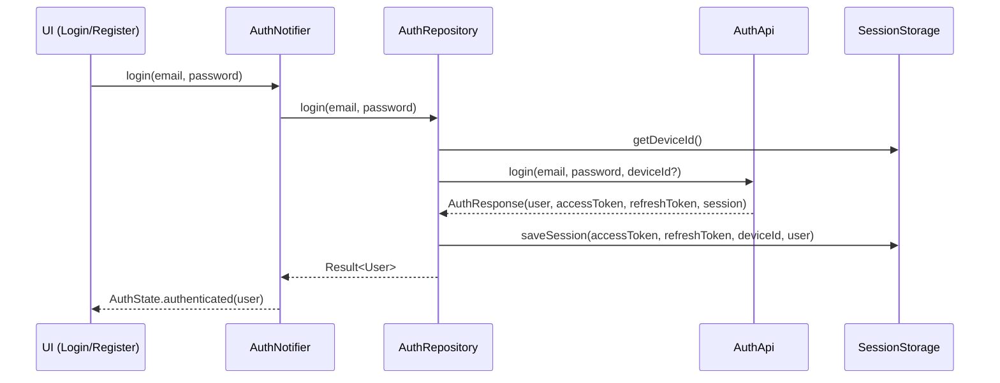

EN | [TR](../tr/Auth.tr.md)

# Auth Flow & Session Management

This document describes the **authentication flow**, including login/register, token handling, session restore, and logout.  
The goal is to keep auth logic **predictable, testable, and decoupled** from UI widgets.

Related docs:
- Routing guards and protected routes: [`Routing.md`](Routing.md)
- Storage & session persistence: [`Storage.md`](Storage.md)
- Error handling & Result type: [`ErrorHandling.md`](ErrorHandling.md)

---

## Contents

1. [Architecture](#architecture)
2. [File structure](#file-structure)
3. [Key concepts](#key-concepts)
4. [Usage](#usage)
5. [Developer guide](#developer-guide)
6. [Troubleshooting](#troubleshooting)
7. [References](#references)

---

## Architecture



On app startup, `AuthNotifier` asks `AuthRepository` to **restore** the session from `SessionStorage`, so routing guards can decide whether to show auth screens or the main shell.

---

## File structure

```text
lib/features/auth/
├── data/
│   ├── auth_api.dart          # HTTP calls (login/register/refresh/logout/getMe)
│   └── auth_repository.dart   # Result<User> wrappers + session handling
└── presentation/
    ├── auth_notifier.dart     # AuthState + side effects (session restore, logout)
    ├── auth_state.dart        # union/sealed AuthState
    ├── auth_providers.dart    # provider wiring for the feature
    ├── login_screen.dart      # Login UI
    └── register_screen.dart   # Register UI
```

Session persistence APIs are defined under `lib/core/storage/` (see [`Storage.md`](Storage.md)).

---

## Key concepts

### AuthState

`AuthState` models where the user is in the auth lifecycle, for example:

- `unauthenticated`
- `loading`
- `authenticated(User user)`
- `failure(Failure failure)`

UI widgets (login/register screens, shell) react to `AuthState` instead of calling `AuthRepository` directly.

### AuthRepository

Responsibilities:

- call `AuthApi` endpoints (`login`, `register`, `logout`, `refreshAccessToken`, `getMe`),
- map network exceptions to `Failure` using the error layer,
- persist and read session via `SessionStorage`:
  - `saveSession(accessToken, refreshToken, deviceId, user)`
  - `hasSession`, `getUser`, `clearSession`.

It exposes **typed** `Result<User>` results to the notifier.

### AuthNotifier

The stateful bridge between UI and repository:

- holds `AuthState`,
- triggers repository calls for login/register/logout/restore,
- updates `AuthState` based on `Result<User>` and storage state,
- exposes a `refreshListenable` used by routing (see `AuthGuard`).

---

## Usage

### Login from UI

```dart
// In login_screen.dart (simplified)
final authNotifier = ref.watch(authNotifierProvider.notifier);

Future<void> _onSubmit() async {
  await authNotifier.login(email: _email, password: _password);
}
```

The notifier:

1. sets `AuthState.loading`,
2. calls `AuthRepository.login`,
3. updates state to `authenticated(user)` or `failure(failure)`.

### Logout

```dart
await authNotifier.logout();
```

Typical responsibilities:

- call `AuthRepository.logout` (optional, depending on backend),
- clear tokens/user from `SessionStorage`,
- set `AuthState.unauthenticated`.

### Session restore

At app startup:

- `AuthNotifier` checks `SessionStorage.hasSession()` and `getUser()`,
- if valid, set `AuthState.authenticated(user)`,
- otherwise stay `unauthenticated`.

Routing (`AuthGuard`) uses this state to decide where to route the user.

---

## Developer guide

### Add new auth fields (e.g. roles/permissions)

1. Extend the `User` model (see [`User.md`](User.md)).
2. Update `AuthApi` response mapping to include the new fields.
3. Persist any additional values you need (e.g. roles) in `SessionStorage` if necessary.
4. Update `AuthState` and UI screens to reflect the new information (e.g. show role-based banners).

### Add a new auth action (e.g. password reset)

1. Add a method in `AuthApi` to call the backend endpoint.
2. Wrap it in `AuthRepository` with `Result<void>` or `Result<Unit>`.
3. Add a corresponding method on `AuthNotifier`.
4. Update screens to call the notifier and react to `AuthState` / `Failure`.

---

## Troubleshooting

- **Redirect loops between login and home**:
  - Check `AuthGuard` rules (see [`Routing.md`](Routing.md)) and how `AuthState` is interpreted.
- **User is logged out unexpectedly**:
  - Inspect `AuthRepository` and `AuthNotifier` to see when `clearSession` is called (e.g. on 401/403).
- **Auth state not restored on app launch**:
  - Ensure `SessionStorage.hasSession` and `getUser` are wired correctly and that startup code invokes session restore.

---

## References

- Auth API: `lib/features/auth/data/auth_api.dart`
- Auth repository: `lib/features/auth/data/auth_repository.dart`
- Notifier & state: `lib/features/auth/presentation/auth_notifier.dart`, `auth_state.dart`
- Providers: `lib/features/auth/presentation/auth_providers.dart`
- Storage: `lib/core/storage/session_storage.dart` + `session_storage_impl.dart`

