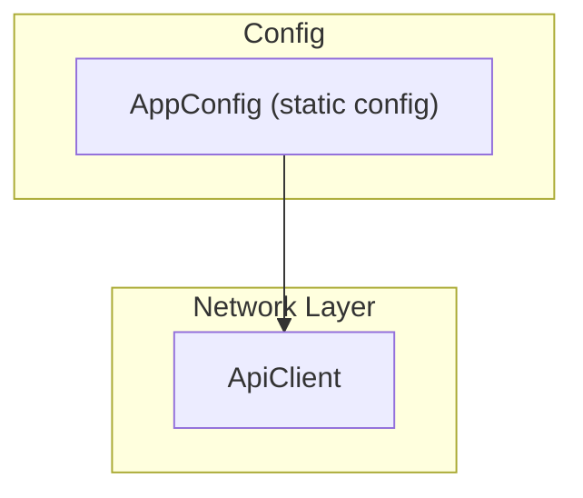

EN | [TR](../tr/Config.tr.md)

# Configuration & Environments

This document describes how application configuration is handled, with a focus on the `AppConfig` class and environment-specific settings.  
The goal is to make it clear **where to change base URLs and other global settings**.

Related docs:
- Network base URL usage: [`Network.md`](Network.md)
- Storage for secrets and tokens: [`Storage.md`](Storage.md)

---

## Contents

1. [Architecture](#architecture)
2. [File structure](#file-structure)
3. [Key concepts](#key-concepts)
4. [Usage](#usage)
5. [Developer guide](#developer-guide)
6. [Troubleshooting](#troubleshooting)
7. [References](#references)

---

## Architecture



`AppConfig` is currently a simple static configuration holder. In larger projects, it can be extended to read from environment variables, flavors, or remote config.

---

## File structure

```text
lib/core/config/
└── app_config.dart   # Central configuration (base URL, future env flags)
```

---

## Key concepts

### AppConfig

The central place for global configuration, for example:

- `apiBaseUrl` – base URL for all backend calls.

Example (from `app_config.dart`):

```dart
class AppConfig {
  const AppConfig._();

  /// Base URL for the backend API.
  ///
  /// In a real project, consider using flavors or `--dart-define` to override
  /// this per environment (dev, staging, prod).
  static const String apiBaseUrl = 'http://localhost:3000';
}
```

This value is typically used when constructing `ApiClient`.

---

## Usage

### Change backend URL for local development

1. Open `lib/core/config/app_config.dart`.
2. Update `apiBaseUrl`:

```dart
static const String apiBaseUrl = 'http://localhost:3000';
// or 'http://192.168.1.50:3000' if hitting a LAN backend
```

### Configure production URL

Before building for production:

```dart
static const String apiBaseUrl = 'https://api.yourdomain.com';
```

---

## Developer guide

### Add more configuration values

Examples:

- feature flags,
- analytics endpoints,
- Sentry DSN, etc.

You can:

1. Add static fields to `AppConfig`:
   ```dart
   static const bool enableDebugLogging = false;
   ```
2. Use them where needed (e.g. logging middleware, error reporting).

### Evolving towards env-specific configs

In a real production app, consider:

- Flutter flavors (dev/staging/prod),
- `--dart-define` values injected at build time,
- a dedicated `Config` object that is created at startup based on environment.

This boilerplate keeps things simple with a single `AppConfig` class you can adapt to your needs.

---

## Troubleshooting

- **App still calls old backend after changing URL**:
  - Make sure the app was rebuilt after changing `AppConfig` (hot reload might not be enough).
- **Different environments (e.g. staging/prod) need different URLs**:
  - Introduce flavors or `--dart-define` and wire them into `AppConfig`.

---

## References

- Config: `lib/core/config/app_config.dart`
- Network usage: `lib/core/network/api_client.dart`

