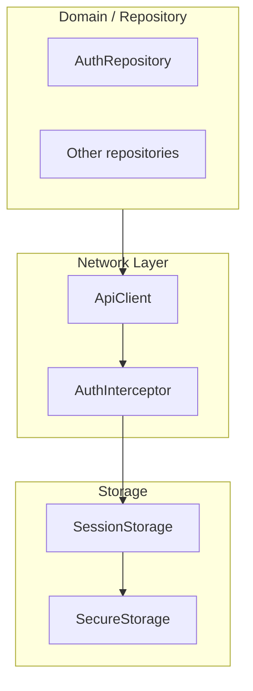

EN | [TR](../tr/Network.tr.md)

# Network Layer (ApiClient & Interceptors)

This document explains the **network layer**, built around a single `ApiClient` and an `AuthInterceptor`.  
The goal is to provide a consistent, testable way to call the backend and handle auth/refresh concerns.

Related docs:
- Error mapping and failures: [`ErrorHandling.md`](ErrorHandling.md)
- Auth flow and session storage: [`Auth.md`](Auth.md)
- Storage for tokens & device id: [`Storage.md`](Storage.md)

---

## Contents

1. [Architecture](#architecture)
2. [File structure](#file-structure)
3. [Key concepts](#key-concepts)
4. [Usage](#usage)
5. [Developer guide](#developer-guide)
6. [Troubleshooting](#troubleshooting)
7. [References](#references)

---

## Architecture



Repositories depend on `ApiClient` instead of talking to `http`/`Dio` directly.  
The auth interceptor is responsible for attaching the access token and, optionally, triggering refresh logic when tokens expire.

---

## File structure

```text
lib/core/network/
├── api_client.dart        # Base HTTP client abstraction
└── auth_interceptor.dart  # Interceptor for auth headers and refresh handling
```

---

## Key concepts

### ApiClient

Responsibilities:

- provide methods like `get`, `post`, `put`, `delete`,
- serialize/deserialize JSON,
- throw typed exceptions (e.g. `ApiException`) when:
  - network fails,
  - server returns non-2xx responses,
  - response body cannot be parsed.

Repositories catch these exceptions and convert them to `Failure` objects (see [`ErrorHandling.md`](ErrorHandling.md)).

### AuthInterceptor

Works in front of the underlying HTTP client:

- reads the current access token from `SessionStorage`,
- attaches it as an `Authorization` header (e.g. `Bearer <token>`),
- may trigger a refresh flow (via `AuthRepository`) when:
  - the backend responds with `401 Unauthorized`,
  - or when backend-specific error codes indicate expired tokens.

The exact implementation details live in `auth_interceptor.dart`.

---

## Usage

### From repositories

```dart
// Example pattern (pseudocode)
final json = await apiClient.get('/me');
final user = User.fromJson(json as Map<String, dynamic>);
```

Error handling is **not** done in the UI; instead, repositories:

1. call `ApiClient`,
2. catch `ApiException` and other errors,
3. use `ErrorMapper` to turn them into `Failure`,
4. wrap results in `Result<T>`.

See [`ErrorHandling.md`](ErrorHandling.md) for the full error pipeline.

---

## Developer guide

### Add a new endpoint

1. Add a method to the appropriate repository (e.g. `AuthRepository`, `ProfileRepository`).
2. Inside that method:
   - call `ApiClient.get/post/...` with the correct path and body,
   - parse JSON into domain models,
   - wrap in `Result<T>` with proper error mapping.
3. Keep URI construction and query parameter handling close to the repository; avoid scattering URL strings in UI.

### Customize headers

If you need extra headers for a specific request:

- either extend `ApiClient` API to accept a per-call `headers` map,
- or add a dedicated method (e.g. `postMultipart`) depending on your backend’s needs.

### Add new interceptors

For cross-cutting concerns like logging or tracing:

1. Add a new interceptor around the underlying HTTP client (or extend `ApiClient`).
2. Ensure ordering:
   - logging/tracing can wrap around auth,
   - auth must see the final request (with URL and body) to attach headers correctly.

---

## Troubleshooting

- **401 responses despite being logged in**:
  - Ensure `AuthInterceptor` is reading the latest access token from `SessionStorage`.
  - Check that `SessionStorage.saveSession` is called after login and refresh.
- **Unexpected logout on 401**:
  - Inspect how the interceptor handles repeated 401 responses (e.g. clear session vs retry).
- **Parsing errors / “unknown error”**:
  - Verify the response shape matches expectations and adjust parsing in repositories or `ErrorMapper`.

---

## References

- Network client: `lib/core/network/api_client.dart`
- Auth interceptor: `lib/core/network/auth_interceptor.dart`
- Storage: `lib/core/storage/session_storage.dart`, `secure_storage.dart`
- Errors: `lib/core/errors/app_exception.dart`, `error_mapper.dart`

