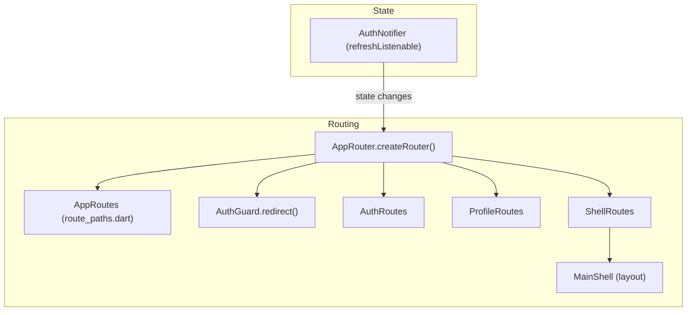

# Routing (GoRouter, Guards, Shell)

EN | [TR](../tr/Routing.tr.md)

This document describes the project’s routing architecture built on **GoRouter**:
- modular route definitions per feature,
- centralized path constants,
- an authentication redirect guard,
- optional shell routing (layout wrapper).

Related docs:
- Auth flow: [`Auth.md`](Auth.md)
- UI layout shell: `lib/ui/layout/main_shell.dart`

---

## Contents

1. [Architecture](#architecture)
2. [File structure](#file-structure)
3. [Key concepts](#key-concepts)
4. [Usage](#usage)
5. [Developer guide](#developer-guide)
6. [Troubleshooting](#troubleshooting)
7. [References](#references)

---

## Architecture



Routing decision flow (high-level):

```mermaid
flowchart TB
  nav[Navigation_attempt] --> guard[AuthGuard.redirect]
  guard --> loading{Auth_loading?}
  loading -->|yes| allow[Allow (null)]
  loading -->|no| loggedIn{Is_authenticated?}
  loggedIn -->|no| protected{Protected_route?}
  protected -->|yes| toLogin[Redirect to /login]
  protected -->|no| allow
  loggedIn -->|yes| authRoute{Auth_route?}
  authRoute -->|yes| toHome[Redirect to /]
  authRoute -->|no| allow
```

---

## File structure

```text
lib/routing/
├── app_router.dart           # GoRouter setup + mode selection
├── route_paths.dart          # Central route path constants
├── guards/
│   └── auth_guard.dart       # Auth redirect logic
└── builders/
    ├── auth_routes.dart      # /login, /register
    ├── profile_routes.dart   # authenticated feature routes (plain mode)
    └── shell_routes.dart     # ShellRoute + MainShell routes (shell mode)
```

---

## Key concepts

### Central paths (`AppRoutes`)

All paths live in `lib/routing/route_paths.dart` to avoid string literals and typos.

### Modular route builders

Each feature exposes routes via a small builder file (e.g. `AuthRoutes.routes`).

### Guard/redirect (`AuthGuard`)

`AuthGuard.redirect` decides whether to:
- allow navigation (`null`),
- redirect to login,
- redirect away from auth screens when already logged in.

### Routing modes (plain vs shell)

`AppRouter.createRouter(context, mode: ...)` selects between:
- **plain**: feature routes mounted directly
- **shell**: authenticated area wrapped with `ShellRoute` + `MainShell` layout

---

## Usage

### Navigate with paths

Use GoRouter helpers (examples):
- `context.go(AppRoutes.login)`
- `context.push(AppRoutes.home)`
- `context.pop()`

Avoid hard-coded `'/login'` strings in UI code.

### Enable shell routing

In `lib/main.dart`, pass `mode: RoutingMode.shell` to the router factory (see `lib/routing/app_router.dart` for the exact API).

---

## Developer guide

### Add a new route

1. Add a constant to `lib/routing/route_paths.dart`
2. Add a `GoRoute` entry to the appropriate builder under `lib/routing/builders/`
3. If the route should be public (no auth), adjust `AuthGuard` logic accordingly

### Add a new feature module with routes

1. Create `lib/routing/builders/<feature>_routes.dart`
2. Export the feature routes as `static List<RouteBase> get routes`
3. Mount them in `AppRouter.createRouter` for the desired mode(s)

---

## Troubleshooting

- **Redirect loops**: check `AuthGuard.redirect` conditions and ensure “auth route” vs “protected route” classification is correct.
- **Shell routes not showing layout**: ensure you’re using `RoutingMode.shell` and the routes are defined inside `ShellRoutes`.
- **Router not reacting to auth changes**: ensure `refreshListenable` is wired to `AuthNotifier`.

---

## References

- Router factory: `lib/routing/app_router.dart`
- Paths: `lib/routing/route_paths.dart`
- Guard: `lib/routing/guards/auth_guard.dart`
- Shell: `lib/routing/builders/shell_routes.dart` and `lib/ui/layout/main_shell.dart`

