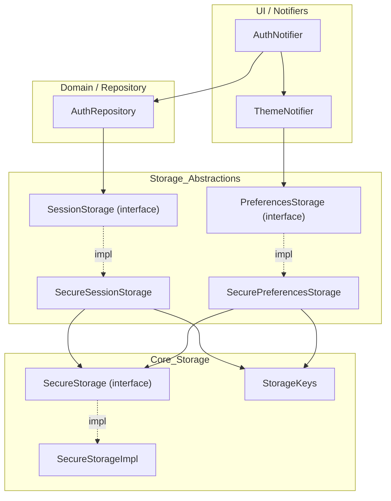

# Storage & Session Architecture

EN | [TR](../tr/Storage.tr.md)

This document covers the **persistence layer** of the app:
- generic key–value API (`SecureStorage`),
- session storage for auth (`SessionStorage`),
- preferences storage (theme mode, future user prefs).

Related docs:
- Theme persistence: [`ThemeProvider.md`](ThemeProvider.md)
- Auth session flow: [`Auth.md`](Auth.md)

---

## Contents

1. [Architecture](#architecture)
2. [File structure](#file-structure)
3. [Key concepts](#key-concepts)
4. [Usage](#usage)
5. [Developer guide](#developer-guide)
6. [Troubleshooting](#troubleshooting)
7. [References](#references)

---

## Architecture



---

## File structure

```text
lib/core/storage/
├── secure_storage.dart            # SecureStorage interface
├── secure_storage_impl.dart       # platform-aware implementation
├── storage_keys.dart              # central key constants
├── session_storage.dart           # SessionStorage interface
├── session_storage_impl.dart      # SecureSessionStorage implementation
├── preferences_storage.dart       # PreferencesStorage interface
└── preferences_storage_impl.dart  # SecurePreferencesStorage implementation
```

---

## Key concepts

### SecureStorage

Thin abstraction over secure key–value storage:
- `write`, `read`, `delete`, `deleteAll`, `readAll`
- platform-specific details live in `SecureStorageImpl` (e.g. `flutter_secure_storage` or file-based fallback)

### StorageKeys

Central place for all storage keys:
- `accessToken`, `refreshToken`, `deviceId`, `user`
- `themeMode`

Prevents magic strings and keeps key naming aligned with backend/API expectations.

### SessionStorage

Domain-level API for auth/session:
- `saveSession(...)`
- `getAccessToken`, `getRefreshToken`, `getDeviceId`
- `getUser` / `saveUser`
- `hasSession`
- `clearSession`

### PreferencesStorage

Domain-level API for user prefs:
- `getThemeMode`
- `saveThemeMode`

Future preferences (locale, notification opt-ins, etc.) should be added here.

---

## Usage

### App startup wiring (`main.dart`)

At startup, a single `SecureStorageImpl` instance is created and shared:
- `SecureSessionStorage` for auth/session
- `SecurePreferencesStorage` for theme mode

`AuthNotifier` and `ThemeNotifier` receive these abstractions via constructor injection.

### Session flow (high-level)

1. User logs in (`AuthNotifier` → `AuthRepository`)
2. `AuthRepository`:
   - calls API
   - on success, calls `SessionStorage.saveSession(...)`
3. `SessionStorage` writes tokens/deviceId/user using `SecureStorage` and `StorageKeys`

On app relaunch, `AuthRepository` can restore the session via `SessionStorage.hasSession` and `getUser`.

---

## Developer guide

### Add a new persistent preference

Example: `locale`

1. Add a key in `StorageKeys`:
   ```dart
   static const locale = 'locale';
   ```
2. Extend `PreferencesStorage`:
   ```dart
   abstract class PreferencesStorage {
     Future<ThemeMode?> getThemeMode();
     Future<void> saveThemeMode(ThemeMode mode);

     Future<Locale?> getLocale();
     Future<void> saveLocale(Locale locale);
   }
   ```
3. Implement it in `SecurePreferencesStorage` using `SecureStorage`
4. Inject it into a new or existing notifier (e.g. `LocaleNotifier`)

### Add a new session-related field

Example: `refreshTokenExpiry`

1. Extend `SessionStorage` interface and its implementation
2. Ensure `AuthRepository.saveSession` writes the new value
3. Read it in any logic that needs it (e.g. refresh scheduling)

---

## Troubleshooting

- **Session not restored**: verify `hasSession` checks all required fields (tokens + user) and that `saveSession` is called after login/register.
- **Theme preference lost**: check `PreferencesStorage.saveThemeMode` calls and any error logs from `ThemeNotifier._saveThemePreference`.
- **Unexpected logout**: look at `AuthRepository` logic for clearing session (e.g. on 401/403 responses).

---

## References

- Core interfaces: `lib/core/storage/secure_storage.dart`
- Storage keys: `lib/core/storage/storage_keys.dart`
- Session: `lib/core/storage/session_storage.dart` + `session_storage_impl.dart`
- Preferences: `lib/core/storage/preferences_storage.dart` + `preferences_storage_impl.dart`
