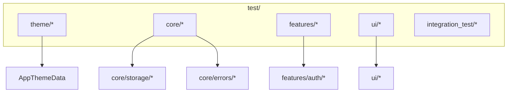

EN | [TR](../tr/Testing.tr.md)

# Testing Guide

This document explains how testing is organized in the project and how to add new tests.  
The goal is to cover **core behavior** (theme, errors, storage, auth) without requiring full-blown integration for every change.

Related docs:
- Theme system: [`ThemeProvider.md`](ThemeProvider.md)
- Storage & session: [`Storage.md`](Storage.md)
- Error handling: [`ErrorHandling.md`](ErrorHandling.md)

---

## Contents

1. [Architecture](#architecture)
2. [File structure](#file-structure)
3. [Key concepts](#key-concepts)
4. [Usage](#usage)
5. [Developer guide](#developer-guide)
6. [Troubleshooting](#troubleshooting)
7. [References](#references)

---

## Architecture



The test folder mirrors the structure of `lib/` at a high level, making it easier to find where to put new tests.

---

## File structure

```text
test/
├── theme/
│   ├── theme_builder_test.dart
│   ├── theme_data_test.dart
│   └── theme_notifier_test.dart
├── core/
│   ├── storage/           # (place storage tests here)
│   ├── network/           # (place network tests here)
│   ├── models/            # (place model tests here)
│   └── errors/            # (place error tests here)
├── features/
│   └── auth/
│       ├── data/          # (auth_repository tests)
│       └── presentation/  # (auth_notifier tests)
├── ui/
│   ├── atoms/             # (UI atom tests)
│   └── molecules/         # (UI molecule tests)
└── integration_test/      # (optional end-to-end style tests)
```

Some directories contain `.gitkeep` files and are intentionally empty placeholders ready for future tests.

---

## Key concepts

### Unit vs integration tests

- **Unit tests**:
  - focus on a single class/function (e.g. `ThemeNotifier`, `AuthRepository`),
  - mock or fake external dependencies.
- **Integration tests**:
  - exercise multiple layers together (e.g. auth flow with a fake backend),
  - live under `integration_test/`.

### What is already covered

- Theme:
  - `AppThemeData` token behavior,
  - `ThemeBuilder` mapping to `ThemeData`,
  - `ThemeNotifier` state changes.

You can extend coverage similarly for storage, network, and auth.

---

## Usage

### Run all tests

```bash
flutter test
```

### Run a single file

```bash
flutter test test/theme/theme_notifier_test.dart
```

### Filter by test name

```bash
flutter test --name "ThemeNotifier toggles theme mode"
```

---

## Developer guide

### Add a unit test for a new class

1. Identify the module:
   - `lib/core/...` → `test/core/...`
   - `lib/features/auth/...` → `test/features/auth/...`
2. Create a test file with a matching name (e.g. `auth_repository_test.dart`).
3. Use `package:test` (and `flutter_test` where needed) to write expectations.

Example structure:

```dart
import 'package:flutter_test/flutter_test.dart';

void main() {
  group('AuthRepository', () {
    test('returns failure when login fails', () async {
      // Arrange fake ApiClient/AuthApi
      // Act
      // Assert on Result<Failure>
    });
  });
}
```

### Add widget tests for UI components

1. Place tests under `test/ui/atoms/` or `test/ui/molecules/`.
2. Use `WidgetTester` to pump widgets and assert on behavior and visuals.

---

## Troubleshooting

- **Tests are flaky**:
  - Avoid real network calls; inject fakes/mocks instead.
  - Prefer deterministic timeouts and delay handling.
- **Tests are slow**:
  - Keep heavy integration tests in `integration_test/` and run them less frequently.
- **Difficult to mock dependencies**:
  - Use dependency injection (providers/constructors) to pass fakes into notifiers and repositories.

---

## References

- Theme tests: `test/theme/*`
- General test readme: `test/README.md`
- Flutter testing docs: `https://docs.flutter.dev/cookbook/testing/`

