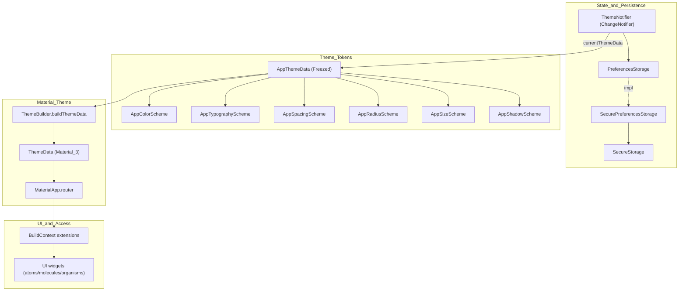

# Theme Provider & Design Tokens

EN | [TR](../tr/ThemeProvider.tr.md)

This document explains the project’s **theme architecture** and how **design tokens** are exposed to the UI layer.
The goal is to make UI styling consistent, modular, and easily extensible (light/dark/system).

Related docs:
- UI component system: [`UI.md`](UI.md)
- Storage layer (preferences persistence): [`Storage.md`](Storage.md)

---

## Contents

1. [Architecture](#architecture)
2. [File structure](#file-structure)
3. [Design tokens](#design-tokens)
4. [Material ThemeData integration](#material-themedata-integration)
5. [Accessing tokens in UI (BuildContext extensions)](#accessing-tokens-in-ui-buildcontext-extensions)
6. [Developer guide](#developer-guide)
7. [Troubleshooting](#troubleshooting)
8. [References](#references)

---

## Architecture



Theme mode persistence (toggle/save/load) is part of the **Storage** architecture; see [`Storage.md`](Storage.md).

---

## File structure

```text
lib/theme/
├── theme_data.dart                         # AppThemeData (Freezed)
├── theme_builder.dart                      # AppThemeData → ThemeData mapping
├── theme_notifier.dart                     # ThemeMode state + persistence
├── color_schemes/
│   ├── app_color_scheme.dart
│   ├── light_color_scheme.dart
│   └── dark_color_scheme.dart
├── typography_schemes/app_typography_scheme.dart
├── spacing_schemes/app_spacing_scheme.dart
├── radius_schemes/app_radius_scheme.dart
├── size_schemes/app_size_scheme.dart
├── shadow_schemes/app_shadow_scheme.dart
├── extensions/
│   ├── theme_context_extensions.dart       # context.appColors/appSpacing/...
│   ├── theme_data_extensions.dart          # AppThemeData.toThemeData()
│   └── spacing_extensions.dart             # EdgeInsets helpers
└── theme.dart                              # Barrel export
```

---

## Design tokens

The token system is split into small “schemes” so they can evolve independently.

### Colors (`AppColorScheme`)

Semantic colors (examples):
- `primary`, `background`, `surface`, `surfaceVariant`, `border`, `overlay`
- `textPrimary`, `textSecondary`, `textDisabled`
- `success`, `error`, `warning`, `info`

Light and Dark implementations:
- `lib/theme/color_schemes/light_color_scheme.dart`
- `lib/theme/color_schemes/dark_color_scheme.dart`

### Typography (`AppTypographyScheme`)

Text styles:
- `headline`, `title`, `body`, `bodySmall`, `button`, `caption`

### Spacing (`AppSpacingScheme`)

Spacing tokens are split into:

- **Primitive scale** (4px grid): `s0, s2, s4, s6, s8, s12, s16, s24, s32`
- **Semantic (component-level) tokens**: component defaults that reference the primitive scale, so you can customize spacing for one component type without affecting others.

Semantic spacing tokens (current defaults):
- `buttonPaddingX` (default: 16), `buttonPaddingY` (default: 10), `buttonIconGap` (default: 8)
- `inputPaddingX` (default: 12), `inputPaddingY` (default: 10)
- `cardPadding` (default: 16)
- `dialogPadding` (default: 24)
- `sheetPadding` (default: 16)
- `toastPaddingX` (default: 16), `toastPaddingY` (default: 12)
- `badgePaddingX` (default: 6), `badgePaddingY` (default: 2)
- `sectionGapSm` (default: 8), `sectionGapMd` (default: 16), `sectionGapLg` (default: 24)

### Radius (`AppRadiusScheme`)

Radius tokens are kept intentionally small and semantic:

- **Primitive-like helpers**: `small` (used by a few components), `full` (pill/circle)
- **Semantic (component-level) tokens**: component defaults that can diverge from each other without duplicating primitives.

Semantic radius tokens (current defaults):
- `button` (default: 8)
- `card` (default: 8)
- `input` (default: 8)
- `dialog` (default: 12)
- `sheet` (default: 12)
- `badge` (default: 9999)
- `alert` (default: 8)
- `chip` (default: 8)
- `toast` (default: 8)
- `popover` (default: 8)
- `contextMenu` (default: 8)
- `calendar` (default: 8)
- `toggle` (default: 8)
- `pagination` (default: 8)
- `avatar` (default: 8)
- `indicator` (default: 6)
- `checkbox` (default: 6)
- `datePicker` (default: 12)

### Sizes (`AppSizeScheme`)

Component-level dimensions (icons/buttons/inputs/avatars) resolved via:

- `AppComponentSize.sm/md/lg` helpers:
  - `iconSize(size)`
  - `buttonHeight(size)`
  - `inputHeight(size)`
  - `avatarSize(size)`

These are consumed by atoms (e.g. `AppButton`, `AppTextField`, `AppTextarea`, avatar components) so that changing `buttonHeightSm/Md/Lg` or `inputHeightSm/Md/Lg` in `DefaultSizeScheme` immediately affects all relevant components.

### Shadows (`AppShadowScheme`)

The shadow system is minimal by design:

- `none`: no shadow (flat surfaces)
- `popover`: used for popover-like surfaces and overlays
- `toggleSelected`: subtle emphasis for selected toggle items

Use `context.appShadows.list(token)` to convert a single shadow into a `List<BoxShadow>` when needed.

---

## Material ThemeData integration

`ThemeBuilder` maps tokens into Material 3 `ThemeData` so default Material widgets inherit your design system:
- form inputs (`InputDecorationTheme`)
- checkbox/radio/switch
- progress indicators
- tabs
- date picker
- snackbar (toast)
- drawer
- slider
- card/dialog/bottom sheet

---

## Accessing tokens in UI (BuildContext extensions)

Use `BuildContext` extensions to read tokens consistently:

```dart
final colors = context.appColors;
final spacing = context.appSpacing;
final radius = context.appRadius;
final typography = context.appTypography;
final sizes = context.appSizes;
final shadows = context.appShadows;
```

---

## Developer guide

### Add a new token group

Example: `AppBorderWidthScheme`

1. Create a scheme file under `lib/theme/<scheme_group>/...`
2. Add it as a required field to `AppThemeData`
3. Provide a default implementation
4. Expose it via `ThemeContextExtensions` (e.g. `context.appBorderWidths`)
5. Apply it in `ThemeBuilder` where relevant

### Create new UI components

Follow Atomic Design:
- `atoms`: primitives
- `molecules`: small compositions
- `organisms`: overlays/flows/composites

Always prefer tokens over hard-coded values; see [`UI.md`](UI.md).

---

## Refactor roadmap

This design system evolves in waves to keep changes reviewable:

1. **Wave 1 – Add semantic aliases**: introduce semantic/component-level tokens (e.g. `radius.button`, `spacing.inputPaddingX`, `shadows.popover`) mapped to existing primitives.
2. **Wave 2 – Migrate UI components**: move atoms/molecules/organisms to semantic tokens; remove hardcoded values (`Colors.*`, `EdgeInsets(...)`, `BoxShadow(...)`) where theme-driven.
3. **Wave 3 – Align Material mapping**: update `ThemeBuilder` so Material widgets also consume semantic tokens.
4. **Wave 4 – Remove legacy tokens**: delete deprecated legacy token classes once no longer referenced.

---

## Troubleshooting

- **Theme changes not reflected**: ensure widgets read values from `context.*` and not from cached theme objects.
- **New token not accessible in UI**: verify it’s added to `AppThemeData` and exposed via `ThemeContextExtensions`.
- **Material widgets look off**: update the corresponding theme section inside `ThemeBuilder`.

---

## References

- Theme tokens: `lib/theme/theme_data.dart`
- Theme state: `lib/theme/theme_notifier.dart`
- Token accessors: `lib/theme/extensions/theme_context_extensions.dart`
- Material mapping: `lib/theme/theme_builder.dart`
- UI system: [`UI.md`](UI.md)

