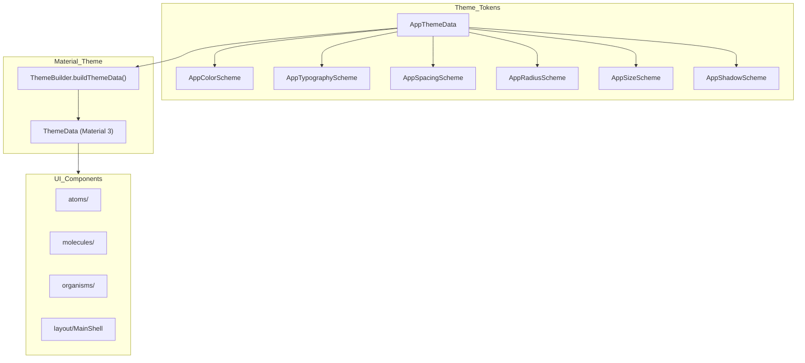

EN | [TR](../tr/UI.tr.md)

# UI System (Atoms / Molecules / Organisms)

This document describes the **modular UI system** in the project and how it integrates with the design tokens.  
The goal is to clearly answer: **“which widget lives where, how is it used, how is it extended?”**

- **Atomic design** folder structure: `atoms/`, `molecules/`, `organisms/`, `layout/`
- **Theme‑driven**: all components consume `AppThemeData` tokens
- **Size/spacing control**: `spacing`, `radius`, `sizes`, `shadows` tokens + helper extensions
- **Barrel exports**: `lib/ui/ui.dart` and `lib/theme/theme.dart` for single‑import usage

Related docs:
- Theme architecture & token layer: [`ThemeProvider.md`](ThemeProvider.md)
- Shell layout & routing: [`Routing.md`](Routing.md)

---

## Contents

1. [Architecture](#architecture)
2. [File structure](#file-structure)
3. [Key concepts](#key-concepts)
4. [Usage](#usage)
5. [Developer guide](#developer-guide)
6. [Troubleshooting](#troubleshooting)
7. [References](#references)

---

## Architecture



In short:

- Design decisions are centralized under `AppThemeData`.
- `ThemeBuilder` maps these tokens to Material `ThemeData`.
- UI components access tokens using `BuildContext` extensions.

---

## File structure

```text
lib/
├── theme/
│   ├── theme_data.dart
│   ├── theme_builder.dart
│   ├── theme_notifier.dart
│   ├── color_schemes/
│   ├── typography_schemes/
│   ├── spacing_schemes/
│   ├── radius_schemes/
│   ├── size_schemes/
│   ├── shadow_schemes/
│   ├── extensions/
│   └── theme.dart                 # barrel export
└── ui/
    ├── atoms/
    │   ├── atoms.dart             # barrel export
    │   └── ... (atoms)
    ├── molecules/
    │   ├── molecules.dart         # barrel export
    │   └── ... (molecules)
    ├── organisms/
    │   ├── organisms.dart         # barrel export
    │   └── ... (organisms)
    ├── layout/
    │   └── main_shell.dart
    └── ui.dart                    # barrel export (atoms + molecules + organisms)
```

---

## Key concepts

### Atomic Design

- **Atoms**: Small, self‑contained widgets  
  Examples: `AppCard`, `AppBadge`, `AppCheckbox`, `AppSpinner`, `AppSkeleton`, `AppAlert`.
- **Molecules**: A composition of multiple atoms or Material widgets  
  Examples: `AppSelect`, `AppTabs`, `AppButtonGroup`, `AppAccordion`, `AppPagination`.
- **Organisms**: Larger flows or overlay‑based structures  
  Examples: `AppDialog`, `AppToast`, `AppDatePicker`, `AppSheet`, `AppDataTable`.

### Theme‑first approach

- Never hard‑code colors/spacing/radius; always use tokens:
  - `context.appColors`
  - `context.appTypography`
  - `context.appSpacing`
  - `context.appRadius`
  - `context.appSizes`
  - `context.appShadows`
- Defaults come from tokens, but most components accept overrides like `padding`, `color`, `radius`, etc.

### Barrel imports

- UI:
  - `import 'package:flutter_frontend_boilerplate/ui/ui.dart';`
- Theme:
  - `import 'package:flutter_frontend_boilerplate/theme/theme.dart';`

This keeps imports clean and makes refactors easier (path changes in one place).

---

## Usage

### Spacing and typography with tokens

```dart
final spacing = context.appSpacing;

return Padding(
  padding: EdgeInsets.all(spacing.s16),
  child: Column(
    crossAxisAlignment: CrossAxisAlignment.start,
    children: [
      Text('Title', style: context.appTypography.title),
      VGap(spacing.s12),
      const Text('Body'),
    ],
  ),
);
```

### Atom examples

```dart
AppCard(
  child: Column(
    crossAxisAlignment: CrossAxisAlignment.start,
    children: [
      Text('Title'),
      Gap(context.appSpacing.s8),
      Text('Content'),
    ],
  ),
);
```

```dart
AppBadge(
  label: 'New',
  variant: AppBadgeVariant.success,
);
```

### Molecule example

```dart
AppSelect<String>(
  label: 'Country',
  hint: 'Select a country',
  items: const [
    AppSelectItem(value: 'tr', label: 'Turkey'),
    AppSelectItem(value: 'us', label: 'USA'),
  ],
  value: country,
  onChanged: (v) => setState(() => country = v),
);
```

### Organism example

```dart
await AppDialog.show(
  context,
  title: 'Details',
  content: const Text('Hello'),
  actions: [
    TextButton(
      onPressed: () => Navigator.pop(context),
      child: const Text('Close'),
    ),
  ],
);
```

---

## Developer guide

### 1. Pick the right level

- **atoms**: Simple, reusable base widgets.
- **molecules**: A small composition (2–3 atoms or a complex Material widget).
- **organisms**: Flows/overlays/layout shells or bigger structures like tables.

### 2. Steps to add a new component

1. **Choose the folder**  
   - Single basic widget → `atoms/`  
   - Small composition → `molecules/`  
   - Flow/overlay/page shell → `organisms/` or `layout/`
2. **Use theme tokens**  
   - Do not use hard‑coded colors/spacing/radius.
   - Example:
     ```dart
     final colors = context.appColors;
     final spacing = context.appSpacing;
     final radius = context.appRadius;
     ```
3. **Standardize sizing**  
   - When it makes sense, add small/medium/large variants via `AppComponentSize`.
4. **Add to barrel exports**
   - Atom: `lib/ui/atoms/atoms.dart`
   - Molecule: `lib/ui/molecules/molecules.dart`
   - Organism: `lib/ui/organisms/organisms.dart`
5. **Format + analyze**
   - `dart format .`
   - `dart analyze`

---

## Troubleshooting

- **Component visually diverges from the design**:
  - Ensure it uses tokens (`context.app*`) and no magic numbers.
  - If needed, inspect the mapping in `ThemeBuilder`.
- **Import noise**:
  - Prefer `ui/ui.dart` and `theme/theme.dart` instead of deep path imports.
- **Overlay / layout issues**:
  - Make sure tabs/sheets/dialogs are used inside proper constraints (`Expanded`, `SizedBox`, etc.).

---

## References

- Theme tokens: `lib/theme/theme_data.dart`
- Theme extensions: `lib/theme/extensions/theme_context_extensions.dart`
- UI barrel files: `lib/ui/ui.dart`, `lib/ui/atoms/atoms.dart`, `lib/ui/molecules/molecules.dart`, `lib/ui/organisms/organisms.dart`
- Layout: `lib/ui/layout/main_shell.dart`

