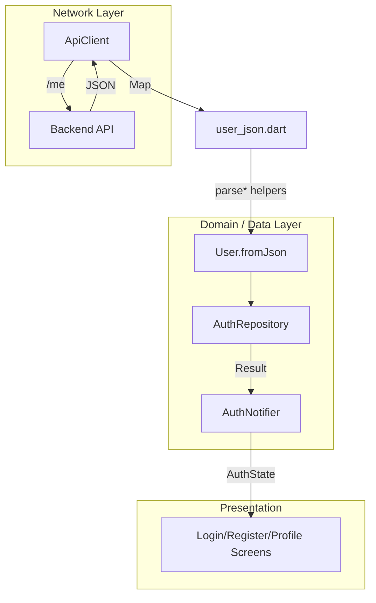

EN | [TR](../tr/User.tr.md)

# User Module

The **User module** contains the core `User` model that is directly tied to authentication and session handling, plus related helpers and profile data.  
The goals are:

- keep the `User` model **aligned with the backend schema** (Prisma),
- centralize backend JSON quirks (e.g. `id` vs `userId`) in one place,
- expose all user-related types through a single barrel file.

Related docs:
- Error model and Result type: [`ErrorHandling.md`](ErrorHandling.md)
- Auth flow: [`Auth.md`](Auth.md)

---

## Contents

1. [Architecture](#architecture)
2. [File structure](#file-structure)
3. [Key concepts](#key-concepts)
4. [Usage](#usage)
5. [Developer guide](#developer-guide)
6. [Troubleshooting](#troubleshooting)
7. [References](#references)

---

## Architecture



The network layer produces raw JSON, which is parsed into `User` (and optionally `Profile`) using helpers.  
Any parsing failures become `ApiException` → `Failure` via the error handling pipeline.

---

## File structure

```text
lib/core/models/user/
├── models.dart          # Barrel export
├── user.dart            # Core User model (freezed)
├── user_extensions.dart # Computed properties / status helpers
├── user_json.dart       # JSON parsing helpers (id/email/flags/datetime)
├── profile.dart         # Profile model (extensible)
├── profile.freezed.dart # Generated (freezed)
├── profile.g.dart       # Generated (json_serializable)
└── user.freezed.dart    # Generated (freezed)
```

Import all user-related types via:

```dart
import 'package:flutter_frontend_boilerplate/core/models/user/models.dart';
```

---

## Key concepts

### Core User model

- Immutable, **freezed**-based data class.
- Contains only auth/core fields:
  - `id`, `email`
  - `emailVerified`, `isSuspended`
  - `lastLoginAt`, `createdAt`, `updatedAt`
- Custom `fromJson` uses helpers to handle backend inconsistencies.

Example (simplified, see source file for full details):

```dart
// lib/core/models/user/user.dart
@freezed
class User with _$User {
  const User._();

  const factory User({
    required String id,
    required String email,
    @Default(false) bool emailVerified,
    @Default(false) bool isSuspended,
    DateTime? lastLoginAt,
    DateTime? createdAt,
    DateTime? updatedAt,
  }) = _User;

  factory User.fromJson(Map<String, dynamic> json) {
    return User(
      id: parseUserId(json),
      email: parseEmail(json),
      emailVerified: parseBool(json, 'emailVerified'),
      isSuspended: parseBool(json, 'isSuspended'),
      lastLoginAt: parseDateTime(json['lastLoginAt']),
      createdAt: parseDateTime(json['createdAt']),
      updatedAt: parseDateTime(json['updatedAt']),
    );
  }
}
```

### JSON helpers (`user_json.dart`)

Centralizes JSON parsing logic so backend changes are handled in one place:

- `parseUserId` supports both `"id"` and `"userId"`, throws `ApiException` if missing.
- `parseEmail` validates presence and type of `"email"`.
- `parseBool` and `parseDateTime` handle common casting cases.

### User extensions

`user_extensions.dart` adds computed properties such as:

- `isActive` – user can use the app (not suspended and email verified),
- `needsEmailVerification`,
- `isSuspendedAccount`.

This keeps business rules close to the model and out of UI widgets.

### Profile model

`profile.dart` contains an extensible profile model:

- keeps `User` focused on auth/core fields,
- allows profile/social fields (`displayName`, `avatarUrl`, `bio`, etc.) to evolve separately.

---

## Usage

### Import once, reuse everywhere

```dart
import 'package:flutter_frontend_boilerplate/core/models/user/models.dart';

Future<void> handleUser(User user) async {
  if (user.isActive) {
    // Normal flow
  } else if (user.needsEmailVerification) {
    // Navigate to verify email
  } else if (user.isSuspendedAccount) {
    // Show suspended account message
  }
}
```

### Parsing from network

```dart
final json = await apiClient.getMe();
final user = User.fromJson(json);
```

For details on how network errors and parsing failures are handled, see [`ErrorHandling.md`](ErrorHandling.md).

---

## Developer guide

### Add a new core field to User

1. Update `User` in `user.dart` (add the field to the factory).
2. Extend the `fromJson` factory to read/parse the new value (ideally via a helper in `user_json.dart`).
3. If needed, update `toJson` to include the new field.
4. Run `dart run build_runner build` (if Freezed code generation is enabled in your workflow).

### Add/change JSON parsing rules

1. Modify or add helpers in `user_json.dart`.
2. If a missing/invalid field should be treated as a **network/domain error**, throw `ApiException` with a clear message.
3. Map that `ApiException` to a `Failure` in the error layer (see [`ErrorHandling.md`](ErrorHandling.md)).

### Extend profile data

1. Add fields to `Profile` in `profile.dart`.
2. Regenerate Freezed/JSON code.
3. Use `Profile` alongside `User` in repositories and notifiers.

---

## Troubleshooting

- **User parsing fails at runtime**:
  - Check `user_json.dart` helpers and ensure backend JSON matches expectations.
- **Auth flow works but UI logic feels scattered**:
  - Move repeated checks into extensions on `User` (e.g. `isActive`, `needsEmailVerification`).
- **Profile changes break existing screens**:
  - Keep `User` and `Profile` responsibilities separate; avoid moving core auth fields into `Profile`.

---

## References

- User model: `lib/core/models/user/user.dart`
- JSON helpers: `lib/core/models/user/user_json.dart`
- Extensions: `lib/core/models/user/user_extensions.dart`
- Profile model: `lib/core/models/user/profile.dart`
- Barrel export: `lib/core/models/user/models.dart`

