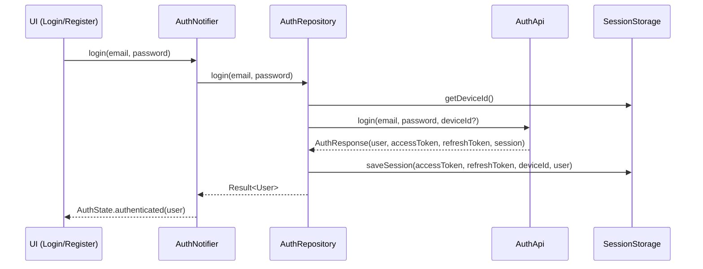

[EN](../en/Auth.md) | TR

# Auth Flow ve Session Yönetimi

Bu doküman, **authentication akışını** (login/register), token yönetimini, session restore ve logout süreçlerini açıklar.  
Hedef, auth mantığını UI widget’larından **ayrılmış**, **test edilebilir** ve **öngörülebilir** tutmaktır.

İlgili dokümanlar:
- Routing guard’ları ve korumalı route’lar: [`Routing.md`](Routing.md)
- Storage & session persist katmanı: [`Storage.md`](Storage.md)
- Hata modeli ve Result tipi: [`ErrorHandling.md`](ErrorHandling.md)

---

## Contents

1. [Architecture](#architecture)
2. [File structure](#file-structure)
3. [Key concepts](#key-concepts)
4. [Usage](#usage)
5. [Developer guide](#developer-guide)
6. [Troubleshooting](#troubleshooting)
7. [References](#references)

---

## Architecture



Uygulama açılışında `AuthNotifier`, `SessionStorage` üzerinden **session restore** yaparak routing guard’larının login ekranı mı yoksa ana shell’i mi göstermesi gerektiğine karar vermesine yardımcı olur.

---

## File structure

```text
lib/features/auth/
├── data/
│   ├── auth_api.dart          # HTTP çağrıları (login/register/refresh/logout/getMe)
│   └── auth_repository.dart   # Result<User> wrapper’ları + session yönetimi
└── presentation/
    ├── auth_notifier.dart     # AuthState + side effect’ler (session restore, logout)
    ├── auth_state.dart        # AuthState union/sealed
    ├── auth_providers.dart    # Feature provider wiring
    ├── login_screen.dart      # Login UI
    └── register_screen.dart   # Register UI
```

Session persist API’leri `lib/core/storage/` altında tanımlıdır (bkz. [`Storage.md`](Storage.md)).

---

## Key concepts

### AuthState

`AuthState`, kullanıcının auth lifecycle içindeki konumunu modeller, örneğin:

- `unauthenticated`
- `loading`
- `authenticated(User user)`
- `failure(Failure failure)`

UI widget’ları (login/register ekranları, shell) doğrudan `AuthRepository` çağırmak yerine bu state’e göre davranır.

### AuthRepository

Sorumluluklar:

- `AuthApi` endpoint’lerini çağırmak (`login`, `register`, `logout`, `refreshAccessToken`, `getMe`),
- network exception’larını error katmanıyla `Failure` tiplerine map etmek,
- `SessionStorage` üzerinden session’ı persist/read etmek:
  - `saveSession(accessToken, refreshToken, deviceId, user)`
  - `hasSession`, `getUser`, `clearSession`.

Notifier’a **typed** `Result<User>` döndürür.

### AuthNotifier

UI ile repository arasındaki stateful köprü:

- `AuthState`’i tutar,
- login/register/logout/restore çağrılarını repository üzerinden tetikler,
- `Result<User>` ve storage durumuna göre state’i günceller,
- routing tarafından kullanılan `refreshListenable`’ı sağlar (bkz. `AuthGuard`).

---

## Usage

### UI’dan login çağrısı

```dart
// login_screen.dart içinde (basitleştirilmiş)
final authNotifier = ref.watch(authNotifierProvider.notifier);

Future<void> _onSubmit() async {
  await authNotifier.login(email: _email, password: _password);
}
```

Notifier tipik olarak:

1. `AuthState.loading` set eder,
2. `AuthRepository.login` çağırır,
3. sonucu `authenticated(user)` veya `failure(failure)` olarak state’e yansıtır.

### Logout

```dart
await authNotifier.logout();
```

Sorumluluklar:

- gerekliyse `AuthRepository.logout` ile backend’e haber vermek,
- `SessionStorage` içindeki token/user bilgisini temizlemek,
- `AuthState.unauthenticated` durumuna dönmek.

### Session restore

App açılışında:

- `AuthNotifier`, `SessionStorage.hasSession()` ve `getUser()` ile geçerli bir session olup olmadığını kontrol eder,
- varsa `AuthState.authenticated(user)` set eder,
- yoksa `unauthenticated` kalır.

Routing (`AuthGuard`), bu state’e göre kullanıcıyı auth ekranlarına mı yoksa ana shell’e mi yönlendireceğini belirler.

---

## Developer guide

### Yeni auth alanları eklemek (örn. rol/permission)

1. `User` modelini genişletin (bkz. [`User.md`](User.md)).
2. `AuthApi` response mapping’ini yeni alanları kapsayacak şekilde güncelleyin.
3. Gerekliyse ek bilgileri `SessionStorage` içinde saklayın.
4. `AuthState` ve UI katmanını bu alanları kullanacak şekilde güncelleyin (örn. rol bazlı banner’lar).

### Yeni auth aksiyonu eklemek (örn. password reset)

1. Backend endpoint’i için `AuthApi` içine yeni method ekleyin.
2. Bunu `AuthRepository` içinde `Result<void>` veya `Result<Unit>` ile wrap edin.
3. `AuthNotifier` içine karşılık gelen bir method ekleyin.
4. İlgili ekranları bu methodu çağıracak ve sonucu `AuthState` / `Failure` üzerinden işleyecek şekilde güncelleyin.

---

## Troubleshooting

- **Login ve home arasında redirect loop oluşuyor**:
  - `AuthGuard` kurallarını (bkz. [`Routing.md`](Routing.md)) ve `AuthState`’in nasıl yorumlandığını kontrol edin.
- **Kullanıcı beklenmedik şekilde logout oluyor**:
  - `AuthRepository` ve `AuthNotifier` içinde `clearSession`’ın ne zaman çağrıldığını (örn. 401/403 durumları) inceleyin.
- **Uygulama açılışında auth state restore olmuyor**:
  - `SessionStorage.hasSession` ve `getUser` wiring’ini ve açılışta restore akışının gerçekten çağrıldığını doğrulayın.

---

## References

- Auth API: `lib/features/auth/data/auth_api.dart`
- Auth repository: `lib/features/auth/data/auth_repository.dart`
- Notifier & state: `lib/features/auth/presentation/auth_notifier.dart`, `auth_state.dart`
- Provider wiring: `lib/features/auth/presentation/auth_providers.dart`
- Session storage: `lib/core/storage/session_storage.dart` + `session_storage_impl.dart`

