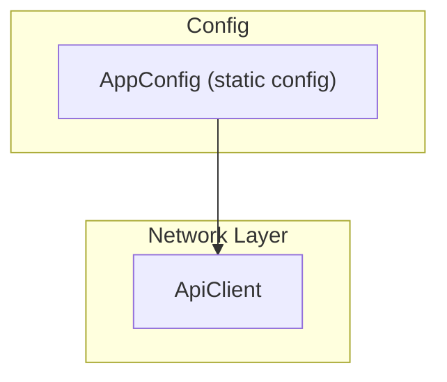

[EN](../en/Config.md) | TR

# Configuration & Environments

Bu doküman, uygulama konfigürasyonunun nasıl yönetildiğini ve özellikle `AppConfig` sınıfını açıklar.  
Amaç, **backend URL’si ve diğer global ayarların nereden değiştirileceğini** netleştirmektir.

İlgili dokümanlar:
- Network katmanında base URL kullanımı: [`Network.md`](Network.md)
- Token ve diğer hassas verilerin saklanması: [`Storage.md`](Storage.md)

---

## Contents

1. [Architecture](#architecture)
2. [File structure](#file-structure)
3. [Key concepts](#key-concepts)
4. [Usage](#usage)
5. [Developer guide](#developer-guide)
6. [Troubleshooting](#troubleshooting)
7. [References](#references)

---

## Architecture



`AppConfig` şu anda basit bir statik config tutucudur. Daha büyük projelerde, environment değişkenleri, flavor’lar veya remote config ile genişletilebilir.

---

## File structure

```text
lib/core/config/
└── app_config.dart   # Merkezi konfigürasyon (base URL, gelecekteki env flag'leri)
```

---

## Key concepts

### AppConfig

Global konfigürasyon için merkezi noktadır, örneğin:

- `apiBaseUrl` – tüm backend çağrıları için base URL.

`app_config.dart` içinden bir örnek:

```dart
class AppConfig {
  const AppConfig._();

  /// Base URL for the backend API.
  ///
  /// In a real project, consider using flavors or `--dart-define` to override
  /// this per environment (dev, staging, prod).
  static const String apiBaseUrl = 'http://localhost:3000';
}
```

Bu değer genellikle `ApiClient` oluşturulurken kullanılır.

---

## Usage

### Lokal geliştirme için backend URL’sini değiştirmek

1. `lib/core/config/app_config.dart` dosyasını açın.
2. `apiBaseUrl` değerini güncelleyin:

```dart
static const String apiBaseUrl = 'http://localhost:3000';
// veya LAN üzerinde çalışan bir backend için:
// 'http://192.168.1.50:3000'
```

### Production URL yapılandırmak

Prod build almadan önce:

```dart
static const String apiBaseUrl = 'https://api.yourdomain.com';
```

---

## Developer guide

### Yeni konfigürasyon alanları eklemek

Örnekler:

- feature flag’ler,
- analytics endpoint’leri,
- Sentry DSN vb.

Yapılabilecekler:

1. `AppConfig` içine statik alan ekleyin:
   ```dart
   static const bool enableDebugLogging = false;
   ```
2. İlgili yerlerde bu alanı kullanın (örn. logging middleware, error reporting).

### Env-spesifik config’e evrilmek

Gerçek bir production uygulamasında:

- Flutter flavors (dev/staging/prod),
- build sırasında verilen `--dart-define` değerleri,
- açılışta environment’a göre oluşturulan bir `Config` objesi

kullanılabilir. Bu boilerplate, basit kalmak için tek bir `AppConfig` sınıfı ile gelir; ihtiyaca göre genişletebilirsiniz.

---

## Troubleshooting

- **URL’yi değiştirdim ama uygulama hâlâ eski backend’e istek atıyor**:
  - `AppConfig` değişikliğinden sonra uygulamanın yeniden build edildiğinden emin olun (sadece hot reload yetmeyebilir).
- **Farklı environment’lar (staging/prod) için farklı URL’ler gerekiyor**:
  - Flavors veya `--dart-define` kullanarak env bazlı config oluşturmayı değerlendirin ve bunu `AppConfig` ile entegre edin.

---

## References

- Config: `lib/core/config/app_config.dart`
- Network kullanım yeri: `lib/core/network/api_client.dart`

