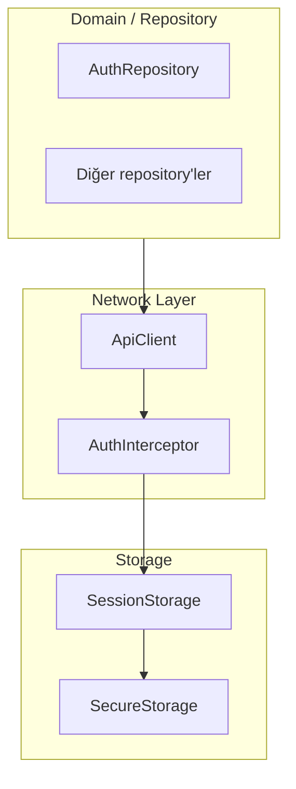

[EN](../en/Network.md) | TR

# Network Katmanı (ApiClient & Interceptor’lar)

Bu doküman, tek bir `ApiClient` ve `AuthInterceptor` üzerine kurulu **network katmanını** açıklar.  
Amaç, backend çağrılarını ve auth/refresh mantığını **tutarlı** ve **test edilebilir** hale getirmektir.

İlgili dokümanlar:
- Hata mapping’i ve Failure tipleri: [`ErrorHandling.md`](ErrorHandling.md)
- Auth akışı ve session storage: [`Auth.md`](Auth.md)
- Token ve device id saklama: [`Storage.md`](Storage.md)

---

## Contents

1. [Architecture](#architecture)
2. [File structure](#file-structure)
3. [Key concepts](#key-concepts)
4. [Usage](#usage)
5. [Developer guide](#developer-guide)
6. [Troubleshooting](#troubleshooting)
7. [References](#references)

---

## Architecture



Repository’ler `http`/`Dio` gibi client’larla doğrudan konuşmak yerine `ApiClient`’a bağımlıdır.  
`AuthInterceptor`, access token eklemekten ve gerekiyorsa refresh akışını tetiklemekten sorumludur.

---

## File structure

```text
lib/core/network/
├── api_client.dart        # Temel HTTP client abstraction
└── auth_interceptor.dart  # Auth header ve refresh mantığı için interceptor
```

---

## Key concepts

### ApiClient

Sorumluluklar:

- `get`, `post`, `put`, `delete` gibi method’lar sağlamak,
- JSON serialize/deserialize işlemlerini yapmak,
- şu durumlarda typed exception (örn. `ApiException`) fırlatmak:
  - network hatası,
  - 2xx dışı HTTP status,
  - response body parse edilemediğinde.

Repository’ler bu exception’ları yakalar ve `ErrorMapper` ile `Failure` tiplerine dönüştürür (bkz. [`ErrorHandling.md`](ErrorHandling.md)).

### AuthInterceptor

Alttaki HTTP client’ın önünde çalışır:

- güncel access token’ı `SessionStorage` üzerinden okur,
- request’e `Authorization: Bearer <token>` header’ını ekler,
- backend `401 Unauthorized` döndüğünde (veya belirli hata kodlarında) refresh akışını (`AuthRepository` aracılığıyla) tetikleyebilir.

Detay implementasyon `auth_interceptor.dart` içinde yer alır.

---

## Usage

### Repository içinden kullanım

```dart
// Örnek pattern (psödo-kod)
final json = await apiClient.get('/me');
final user = User.fromJson(json as Map<String, dynamic>);
```

Error handling **UI’da** yapılmaz; bunun yerine repository:

1. `ApiClient` çağırır,
2. `ApiException` ve diğer hataları yakalar,
3. `ErrorMapper` ile bunları `Failure` tiplerine dönüştürür,
4. Sonucu `Result<T>` ile wrap eder.

Tam hata pipeline’ı için [`ErrorHandling.md`](ErrorHandling.md) dokümanına bakın.

---

## Developer guide

### Yeni endpoint eklemek

1. İlgili repository’ye (örn. `AuthRepository`, `ProfileRepository`) method ekleyin.
2. Bu method içinde:
   - uygun path/body ile `ApiClient.get/post/...` çağırın,
   - JSON’u domain modellere parse edin,
   - hataları `Result<T>` ile sarmalayın.
3. URI oluşturma ve query parametre mantığını repository içinde tutun; UI’da string URL’ler kullanmayın.

### Header’ları özelleştirmek

Belirli bir request için ekstra header gerekiyorsa:

- `ApiClient` API’sini per-call `headers` parametresi alacak şekilde genişletebilir,
- veya backend ihtiyaçlarına göre özel method (örn. `postMultipart`) ekleyebilirsiniz.

### Yeni interceptor eklemek

Logging veya tracing gibi cross-cutting ihtiyaçlar için:

1. Alttaki HTTP client etrafına yeni bir interceptor ekleyin (veya `ApiClient`’i genişletin).
2. Sıralamaya dikkat edin:
   - logging/tracing, auth’un dışına sarılabilir,
   - auth, final request’i (URL + body) görebilmeli ki doğru header ekleyebilsin.

---

## Troubleshooting

- **Login olmuşken 401 almaya devam ediyorum**:
  - `AuthInterceptor`’ın en güncel access token’ı `SessionStorage`’tan okuduğundan emin olun.
  - Login/refresh sonrasında `SessionStorage.saveSession` çağrılarının yapıldığını kontrol edin.
- **401 sonrası beklenmedik logout**:
  - Interceptor’ın tekrar eden 401 durumlarını nasıl ele aldığını inceleyin (ör. session temizleme vs retry).
- **Parse hataları / “unknown error” mesajları**:
  - Response gövdesinin beklenen şemayla uyumlu olduğundan emin olun ve gerekirse repository veya `ErrorMapper` tarafında parsing’i güncelleyin.

---

## References

- Network client: `lib/core/network/api_client.dart`
- Auth interceptor: `lib/core/network/auth_interceptor.dart`
- Storage: `lib/core/storage/session_storage.dart`, `secure_storage.dart`
- Hata katmanı: `lib/core/errors/app_exception.dart`, `error_mapper.dart`

