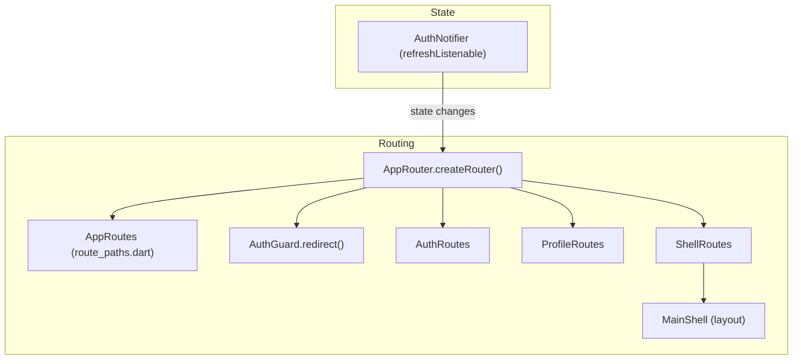

[EN](../en/Routing.md) | TR

# Routing (GoRouter, Guards, Shell)

Bu doküman, projenin **GoRouter** tabanlı routing mimarisini açıklar:
- feature bazlı modüler route tanımları,
- merkezi path sabitleri,
- auth redirect guard,
- opsiyonel shell routing (layout wrapper).

İlgili dokümanlar:
- Auth flow: [`Auth.md`](Auth.md)
- Shell layout: `lib/ui/layout/main_shell.dart`

---

## Contents

1. [Architecture](#architecture)
2. [File structure](#file-structure)
3. [Key concepts](#key-concepts)
4. [Usage](#usage)
5. [Developer guide](#developer-guide)
6. [Troubleshooting](#troubleshooting)
7. [References](#references)

---

## Architecture



Karar akışı (yüksek seviye):

```mermaid
flowchart TB
  nav[Navigation_attempt] --> guard[AuthGuard.redirect]
  guard --> loading{Auth_loading?}
  loading -->|yes| allow[Allow (null)]
  loading -->|no| loggedIn{Is_authenticated?}
  loggedIn -->|no| protected{Protected_route?}
  protected -->|yes| toLogin[Redirect to /login]
  protected -->|no| allow
  loggedIn -->|yes| authRoute{Auth_route?}
  authRoute -->|yes| toHome[Redirect to /]
  authRoute -->|no| allow
```

---

## File structure

```text
lib/routing/
├── app_router.dart           # GoRouter setup + mode selection
├── route_paths.dart          # Merkezi route path sabitleri
├── guards/
│   └── auth_guard.dart       # Auth redirect logic
└── builders/
    ├── auth_routes.dart      # /login, /register
    ├── profile_routes.dart   # authenticated route'lar (plain mode)
    └── shell_routes.dart     # ShellRoute + MainShell (shell mode)
```

---

## Key concepts

### Merkezi path yönetimi (`AppRoutes`)

Tüm path’ler `lib/routing/route_paths.dart` içinde tutulur; UI’da hard-coded string kullanmaktan kaçının.

### Modüler route builder’lar

Her feature route’larını küçük bir builder dosyasıyla export eder (örn. `AuthRoutes.routes`).

### Guard/redirect (`AuthGuard`)

`AuthGuard.redirect` şu kararları verir:
- navigasyona izin (`null`)
- login’e yönlendir
- login/register ekranlarından authenticated kullanıcıyı uzaklaştır

### RoutingMode (plain vs shell)

`AppRouter.createRouter(context, mode: ...)` iki yaklaşımı seçer:
- **plain**: feature route’ları doğrudan mount edilir
- **shell**: authenticated alan `ShellRoute` + `MainShell` ile sarılır

---

## Usage

### Path’lerle navigasyon

GoRouter helper’larını kullanın:
- `context.go(AppRoutes.login)`
- `context.push(AppRoutes.home)`
- `context.pop()`

UI içinde `'/login'` gibi string literal kullanmayın.

### Shell routing’i etkinleştirme

`lib/main.dart` içinde router oluştururken `mode: RoutingMode.shell` verin (tam API için `lib/routing/app_router.dart`).

---

## Developer guide

### Yeni route ekleme

1. `lib/routing/route_paths.dart` içine yeni path sabiti ekleyin
2. İlgili builder dosyasına (`lib/routing/builders/`) `GoRoute` ekleyin
3. Route public olmalıysa `AuthGuard` mantığını buna göre güncelleyin

### Yeni feature + routes ekleme

1. `lib/routing/builders/<feature>_routes.dart` oluşturun
2. `static List<RouteBase> get routes` ile export edin
3. `AppRouter.createRouter` içinde mount edin (plain ve/veya shell)

---

## Troubleshooting

- **Redirect loop**: `AuthGuard.redirect` koşullarını kontrol edin.
- **Shell layout gelmiyor**: `RoutingMode.shell` kullandığınızdan ve `ShellRoutes` içinde route tanımladığınızdan emin olun.
- **Auth değişince router güncellenmiyor**: `refreshListenable`’ın `AuthNotifier`’a bağlı olduğundan emin olun.

---

## References

- Router factory: `lib/routing/app_router.dart`
- Paths: `lib/routing/route_paths.dart`
- Guard: `lib/routing/guards/auth_guard.dart`
- Shell: `lib/routing/builders/shell_routes.dart` ve `lib/ui/layout/main_shell.dart`

