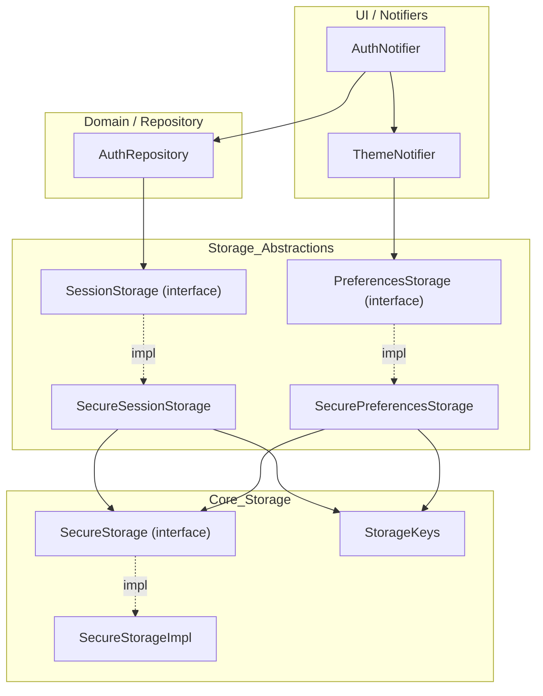

[EN](../en/Storage.md) | TR

# Storage & Session Architecture

Bu doküman, uygulamanın **kalıcı veri saklama** katmanını anlatır:
- generic key–value API (`SecureStorage`),
- auth/session için `SessionStorage`,
- kullanıcı tercihleri için `PreferencesStorage` (tema modu vb.).

İlgili dokümanlar:
- Tema persist: [`ThemeProvider.md`](ThemeProvider.md)
- Auth session akışı: [`Auth.md`](Auth.md)

---

## Contents

1. [Architecture](#architecture)
2. [File structure](#file-structure)
3. [Key concepts](#key-concepts)
4. [Usage](#usage)
5. [Developer guide](#developer-guide)
6. [Troubleshooting](#troubleshooting)
7. [References](#references)

---

## Architecture



---

## File structure

```text
lib/core/storage/
├── secure_storage.dart            # SecureStorage interface
├── secure_storage_impl.dart       # platform-aware implementation
├── storage_keys.dart              # tüm key sabitleri
├── session_storage.dart           # SessionStorage interface
├── session_storage_impl.dart      # SecureSessionStorage implementasyonu
├── preferences_storage.dart       # PreferencesStorage interface
└── preferences_storage_impl.dart  # SecurePreferencesStorage implementasyonu
```

---

## Key concepts

### SecureStorage

Secure key–value API:
- `write`, `read`, `delete`, `deleteAll`, `readAll`
- platform detayları `SecureStorageImpl` içinde (örn. `flutter_secure_storage` veya dosya bazlı fallback)

### StorageKeys

Tüm key string’leri tek yerde:
- `accessToken`, `refreshToken`, `deviceId`, `user`
- `themeMode`

### SessionStorage

Auth/session düzeyi API:
- `saveSession(...)`
- `getAccessToken`, `getRefreshToken`, `getDeviceId`
- `getUser` / `saveUser`
- `hasSession`
- `clearSession`

### PreferencesStorage

Kullanıcı tercihleri:
- `getThemeMode`
- `saveThemeMode`

İleride locale/bildirim tercihleri gibi ek tercihleri de buraya ekleyin.

---

## Usage

### App başlangıcında wiring (`main.dart`)

Başlangıçta tek bir `SecureStorageImpl` örneği oluşturulur ve:
- `SecureSessionStorage` (auth/session)
- `SecurePreferencesStorage` (theme mode)

tarafından paylaşılır. `AuthNotifier` ve `ThemeNotifier` bu abstraction’ları constructor parametresi olarak alır.

### Session akışı (yüksek seviye)

1. Kullanıcı login olur (`AuthNotifier` → `AuthRepository`)
2. `AuthRepository`:
   - API çağrısı yapar
   - başarılı olursa `SessionStorage.saveSession(...)` çağırır
3. `SessionStorage`, token/deviceId/user bilgilerini `SecureStorage` + `StorageKeys` ile yazar

Uygulama yeniden açıldığında `SessionStorage.hasSession` + `getUser` ile session restore edilebilir.

---

## Developer guide

### Yeni bir preference ekleme

Örnek: `locale`

1. `StorageKeys` içine key ekleyin:
   ```dart
   static const locale = 'locale';
   ```
2. `PreferencesStorage` interface’ini genişletin:
   ```dart
   abstract class PreferencesStorage {
     Future<ThemeMode?> getThemeMode();
     Future<void> saveThemeMode(ThemeMode mode);

     Future<Locale?> getLocale();
     Future<void> saveLocale(Locale locale);
   }
   ```
3. `SecurePreferencesStorage` içinde `SecureStorage` kullanarak implemente edin
4. Bunu kullanan yeni/var olan bir notifier yazın (örn. `LocaleNotifier`)

### Yeni session alanı ekleme

Örnek: `refreshTokenExpiry`

1. `SessionStorage` interface ve implementasyonuna ekleyin
2. `AuthRepository.saveSession` içinde bu değeri yazdığınızdan emin olun
3. İlgili logic (örn. refresh scheduling) bu değeri kullansın

---

## Troubleshooting

- **Session restore olmuyor**: `hasSession`’ın gerekli tüm alanları (token + user) kontrol ettiğinden emin olun ve login/register sonrası `saveSession` çağrıldığını kontrol edin.
- **Tema tercihi kayboluyor**: `PreferencesStorage.saveThemeMode` çağrılarını ve `ThemeNotifier._saveThemePreference` log’larını kontrol edin.
- **Beklenmedik logout**: 401/403 yanıtlarında `AuthRepository`’nin session temizleme mantığına bakın.

---

## References

- Core interfaces: `lib/core/storage/secure_storage.dart`
- Storage keys: `lib/core/storage/storage_keys.dart`
- Session: `lib/core/storage/session_storage.dart` + `session_storage_impl.dart`
- Preferences: `lib/core/storage/preferences_storage.dart` + `preferences_storage_impl.dart`

