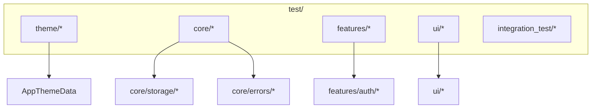

[EN](../en/Testing.md) | TR

# Testing Rehberi

Bu doküman, projedeki test yapısını ve yeni testlerin nasıl ekleneceğini açıklar.  
Hedef, her değişiklik için tam entegrasyon testi yazmak zorunda kalmadan **çekirdek davranışları** (theme, errors, storage, auth) güvence altına almaktır.

İlgili dokümanlar:
- Tema sistemi: [`ThemeProvider.md`](ThemeProvider.md)
- Storage & session mimarisi: [`Storage.md`](Storage.md)
- Hata modeli: [`ErrorHandling.md`](ErrorHandling.md)

---

## Contents

1. [Architecture](#architecture)
2. [File structure](#file-structure)
3. [Key concepts](#key-concepts)
4. [Usage](#usage)
5. [Developer guide](#developer-guide)
6. [Troubleshooting](#troubleshooting)
7. [References](#references)

---

## Architecture



`test/` klasörü, yüksek seviyede `lib/` yapısını yansıtacak şekilde organize edilmiştir; böylece yeni test dosyalarının nereye konulacağı daha görünürdür.

---

## File structure

```text
test/
├── theme/
│   ├── theme_builder_test.dart
│   ├── theme_data_test.dart
│   └── theme_notifier_test.dart
├── core/
│   ├── storage/           # storage testleri için
│   ├── network/           # network testleri için
│   ├── models/            # model testleri için
│   └── errors/            # error testleri için
├── features/
│   └── auth/
│       ├── data/          # auth_repository testleri
│       └── presentation/  # auth_notifier testleri
├── ui/
│   ├── atoms/             # UI atom testleri
│   └── molecules/         # UI molecule testleri
└── integration_test/      # opsiyonel end-to-end tarzı testler
```

Bazı klasörler `.gitkeep` içerir; bunlar, ileride test eklemek için hazır tutulan boş klasörlerdir.

---

## Key concepts

### Unit vs Integration testleri

- **Unit test**:
  - tek bir sınıf/fonksiyona odaklanır (örn. `ThemeNotifier`, `AuthRepository`),
  - harici bağımlılıkları mock/fake ile değiştirir.
- **Integration test**:
  - birden fazla katmanı birlikte dener (örn. sahte backend ile auth flow),
  - `integration_test/` altında yer alır.

### Halihazırda kapsanan alanlar

- Theme:
  - `AppThemeData` token davranışları,
  - `ThemeBuilder` → `ThemeData` mapping,
  - `ThemeNotifier` state değişimleri.

Benzer şekilde storage, network ve auth için de coverage genişletilebilir.

---

## Usage

### Tüm testleri çalıştırmak

```bash
flutter test
```

### Tek bir dosyayı çalıştırmak

```bash
flutter test test/theme/theme_notifier_test.dart
```

### Test ismine göre filtrelemek

```bash
flutter test --name "ThemeNotifier toggles theme mode"
```

---

## Developer guide

### Yeni bir sınıf için unit test eklemek

1. Modülü belirleyin:
   - `lib/core/...` → `test/core/...`
   - `lib/features/auth/...` → `test/features/auth/...`
2. Uygun isimle test dosyası oluşturun (örn. `auth_repository_test.dart`).
3. `package:test` (ve gerektiğinde `flutter_test`) kullanarak beklentileri yazın.

Basit iskelet:

```dart
import 'package:flutter_test/flutter_test.dart';

void main() {
  group('AuthRepository', () {
    test('returns failure when login fails', () async {
      // Arrange: fake ApiClient/AuthApi
      // Act
      // Assert: Result<Failure> beklentisi
    });
  });
}
```

### UI bileşenleri için widget test eklemek

1. Testleri `test/ui/atoms/` veya `test/ui/molecules/` altına koyun.
2. `WidgetTester` ile widget’ı pump edip davranışlarını/görsel durumlarını assert edin.

---

## Troubleshooting

- **Testler flaky (arıza verip tekrar geçiyor)**:
  - Gerçek network çağrılarından kaçının; bunun yerine fake/mocks kullanın.
  - Zamanlama ve timeout’ları deterministik tutmaya çalışın.
- **Testler yavaş**:
  - Ağır integration testlerini `integration_test/` altında toplayın ve daha seyrek çalıştırın.
- **Bağımlılıkları mock’lamak zor**:
  - Notifier ve repository’lere bağımlılıkları constructor/provider üzerinden geçirin; böylece testlerde kolayca fake verebilirsiniz.

---

## References

- Theme testleri: `test/theme/*`
- Genel test README’si: `test/README.md`
- Flutter testing dokümantasyonu: `https://docs.flutter.dev/cookbook/testing/`

