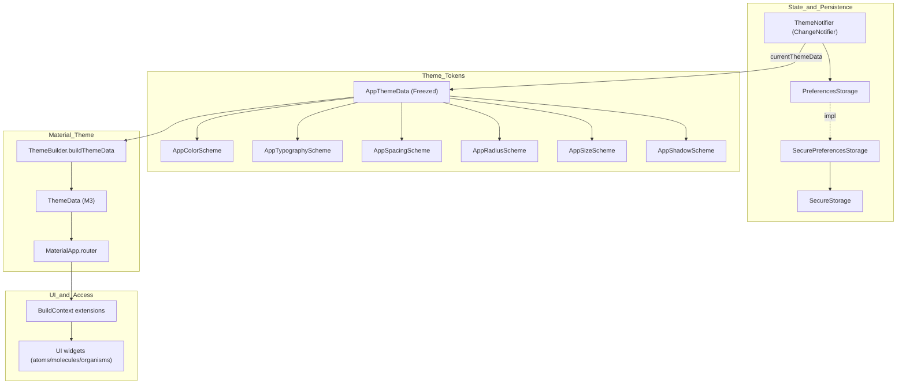

[EN](../en/ThemeProvider.md) | TR

# Theme Provider ve Design Token’lar

Bu doküman, projedeki **tema mimarisini** ve UI katmanının kullandığı **design token** yaklaşımını açıklar.
Hedef: Light/Dark/System tema modlarında **tutarlı**, **modüler** ve **genişletilebilir** bir UI altyapısı sağlamak.

İlgili dokümanlar:
- UI bileşen sistemi: [`UI.md`](UI.md)
- Preferences persist (tema kaydı): [`Storage.md`](Storage.md)

---

## Contents

1. [Architecture](#architecture)
2. [File structure](#file-structure)
3. [Design tokens](#design-tokens)
4. [Material ThemeData integration](#material-themedata-integration)
5. [Accessing tokens in UI (BuildContext extensions)](#accessing-tokens-in-ui-buildcontext-extensions)
6. [Developer guide](#developer-guide)
7. [Troubleshooting](#troubleshooting)
8. [References](#references)

---

## Architecture



Tema modu tercihinin kaydı/yüklenmesi Storage katmanındadır; detay için [`Storage.md`](Storage.md).

---

## File structure

```text
lib/theme/
├── theme_data.dart                         # AppThemeData (Freezed)
├── theme_builder.dart                      # AppThemeData → ThemeData mapping
├── theme_notifier.dart                     # ThemeMode state + persistence
├── color_schemes/
│   ├── app_color_scheme.dart
│   ├── light_color_scheme.dart
│   └── dark_color_scheme.dart
├── typography_schemes/app_typography_scheme.dart
├── spacing_schemes/app_spacing_scheme.dart
├── radius_schemes/app_radius_scheme.dart
├── size_schemes/app_size_scheme.dart
├── shadow_schemes/app_shadow_scheme.dart
├── extensions/
│   ├── theme_context_extensions.dart       # context.appColors/appSpacing/...
│   ├── theme_data_extensions.dart          # AppThemeData.toThemeData()
│   └── spacing_extensions.dart             # EdgeInsets helpers
└── theme.dart                              # Barrel export
```

---

## Design tokens

Token sistemi “scheme” bazlı bölünmüştür; böylece her grup bağımsız evrilebilir.

### Colors (`AppColorScheme`)

Semantik renkler (örnek):
- `primary`, `background`, `surface`, `surfaceVariant`, `border`, `overlay`
- `textPrimary`, `textSecondary`, `textDisabled`
- `success`, `error`, `warning`, `info`

Light/Dark implementasyonları:
- `lib/theme/color_schemes/light_color_scheme.dart`
- `lib/theme/color_schemes/dark_color_scheme.dart`

### Spacing (`AppSpacingScheme`)

Spacing token’ları ikiye ayrılır:

- **Primitif ölçek** (4px grid): `s0, s2, s4, s6, s8, s12, s16, s24, s32`
- **Semantik (bileşen-seviye) token’lar**: primitif ölçeğe referans veren bileşen varsayılanlarıdır. Böylece sadece belirli bir bileşenin spacing’ini değiştirip diğerlerini etkilemezsiniz.

Semantik spacing token’ları (mevcut default’lar):
- `buttonPaddingX` (default: 16), `buttonPaddingY` (default: 10), `buttonIconGap` (default: 8)
- `inputPaddingX` (default: 12), `inputPaddingY` (default: 10)
- `cardPadding` (default: 16)
- `dialogPadding` (default: 24)
- `sheetPadding` (default: 16)
- `toastPaddingX` (default: 16), `toastPaddingY` (default: 12)
- `badgePaddingX` (default: 6), `badgePaddingY` (default: 2)
- `sectionGapSm` (default: 8), `sectionGapMd` (default: 16), `sectionGapLg` (default: 24)

### Radius (`AppRadiusScheme`)

Radius token’ları sade ve semantik tutulur:

- **Primitive-benzeri yardımcılar**: `small` (bazı bileşenler için), `full` (pill/circle)
- **Semantik (bileşen-seviye) token’lar**: bileşen varsayılanlarıdır ve birbirinden bağımsız özelleştirilebilir.

Semantik radius token’ları (mevcut default’lar):
- `button` (default: 8)
- `card` (default: 8)
- `input` (default: 8)
- `dialog` (default: 12)
- `sheet` (default: 12)
- `badge` (default: 9999)
- `alert` (default: 8)
- `chip` (default: 8)
- `toast` (default: 8)
- `popover` (default: 8)
- `contextMenu` (default: 8)
- `calendar` (default: 8)
- `toggle` (default: 8)
- `pagination` (default: 8)
- `avatar` (default: 8)
- `indicator` (default: 6)
- `checkbox` (default: 6)
- `datePicker` (default: 12)

### Sizes (`AppSizeScheme`)

Icon/button/input/avatar gibi component ölçüleri:

- `AppComponentSize.sm/md/lg` helper’ları:
  - `iconSize(size)`
  - `buttonHeight(size)`
  - `inputHeight(size)`
  - `avatarSize(size)`

Bu helper’lar, özellikle atom seviyesindeki bileşenler (`AppButton`, `AppTextField`, `AppTextarea`, avatar bileşenleri) tarafından kullanılır. `DefaultSizeScheme` içindeki `buttonHeightSm/Md/Lg` veya `inputHeightSm/Md/Lg` değerlerini değiştirdiğinizde, ilgili tüm bileşenlerin yüksekliği tek yerden değişir.

### Shadows (`AppShadowScheme`)

Shadow sistemi bilinçli olarak minimaldir:

- `none`: gölge yok (düz yüzeyler)
- `popover`: popover benzeri yüzeyler ve overlay’ler
- `toggleSelected`: seçili toggle item’lar için hafif vurgu

Tek bir `BoxShadow` değerini `List<BoxShadow>`’a çevirmek için `context.appShadows.list(token)` kullanabilirsiniz.

---

## Material ThemeData integration

`ThemeBuilder`, token’ları Material 3 `ThemeData`’ya map eder; böylece default Material widget’ları tasarım sistemine uyar:
- `InputDecorationTheme`
- checkbox/radio/switch
- progress indicator
- tabs
- date picker
- snackbar (toast)
- drawer
- slider
- card/dialog/bottom sheet

---

## Accessing tokens in UI (BuildContext extensions)

UI’da token erişimi standarttır:

```dart
final colors = context.appColors;
final spacing = context.appSpacing;
final radius = context.appRadius;
final typography = context.appTypography;
final sizes = context.appSizes;
final shadows = context.appShadows;
```

---

## Developer guide

### Yeni bir token grubu ekleme

Örn: `AppBorderWidthScheme`

1. `lib/theme/<scheme_group>/...` altında scheme dosyasını ekleyin
2. `AppThemeData`’ya required field olarak ekleyin
3. Default implementasyon yazın (örn. `DefaultBorderWidthScheme`)
4. `theme_context_extensions.dart` içine `context.appBorderWidths` getter’ı ekleyin
5. `ThemeBuilder` içinde ilgili Material theme mapping’ini bağlayın

### Yeni UI bileşeni ekleme

Atomic design’a göre ilerleyin:
- `atoms`: primitive widget’lar
- `molecules`: küçük kompozisyonlar
- `organisms`: overlay/flow/büyük kompozisyonlar

Hard-coded değerler yerine token kullanın; detaylar için [`UI.md`](UI.md).

---

## Refactor roadmap

Bu tasarım sistemi, review edilebilir kalması için dalgalar halinde evriltilir:

1. **Wave 1 – Semantik alias ekleme**: mevcut primitiflere map edilen semantik/bileşen-seviyesi token’ları ekle (örn. `radius.button`, `spacing.inputPaddingX`, `shadows.popover`).
2. **Wave 2 – UI bileşenlerini taşıma**: atoms/molecules/organisms içinde semantik token’lara geç; tema ile ilgili hardcoded değerleri temizle (`Colors.*`, `EdgeInsets(...)`, `BoxShadow(...)`).
3. **Wave 3 – Material mapping hizalama**: `ThemeBuilder` içinde Material widget’larının da semantik token’lardan beslenmesini sağla.
4. **Wave 4 – Legacy token’ları kaldırma**: deprecated legacy token sınıfları artık kullanılmıyorsa tamamen kaldır.

---

## Troubleshooting

- **Tema değişiyor ama UI güncellenmiyor**: widget’ların `context.*` token’larını okuduğundan emin olun (cache’lenmiş değerlerden değil).
- **Yeni token UI’da görünmüyor**: `AppThemeData` + `ThemeContextExtensions` + `ThemeBuilder` zincirini kontrol edin.
- **Material widget görünümü uyumsuz**: ilgili theme bölümünü `ThemeBuilder` içinde güncelleyin.

---

## References

- Theme tokens: `lib/theme/theme_data.dart`
- Theme state: `lib/theme/theme_notifier.dart`
- Token accessors: `lib/theme/extensions/theme_context_extensions.dart`
- Material mapping: `lib/theme/theme_builder.dart`
- UI system: [`UI.md`](UI.md)

