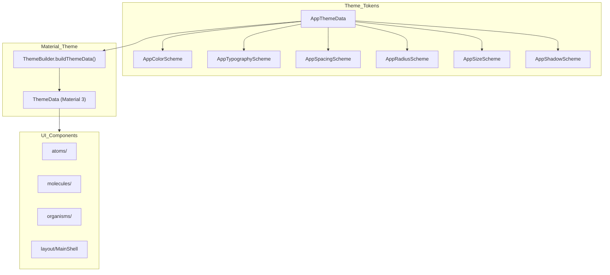

[EN](../en/UI.md) | TR

# UI System (Atoms / Molecules / Organisms)

Bu doküman, projedeki **modüler UI sistemini** ve tasarım token’ları ile olan entegrasyonunu açıklar.  
Amaç; “**hangi widget nerede duruyor, nasıl kullanılır, nasıl genişletilir**” sorularına net cevap vermektir.

- **Atomic Design** klasör yapısı: `atoms/`, `molecules/`, `organisms`, `layout/`
- **Theme uyumu**: tüm bileşenler `AppThemeData` token’larını kullanır
- **Boyut/spacing kontrolü**: `spacing`, `radius`, `sizes`, `shadows` token’ları + helper extension’lar
- **Barrel export**: `lib/ui/ui.dart` ve `lib/theme/theme.dart` üzerinden tek import ile erişim

İlgili dokümanlar:
- Tema mimarisi ve token katmanı: [`ThemeProvider.md`](ThemeProvider.md)
- Shell layout ve routing: [`Routing.md`](Routing.md)

---

## Contents

1. [Architecture](#architecture)
2. [File structure](#file-structure)
3. [Key concepts](#key-concepts)
4. [Usage](#usage)
5. [Developer guide](#developer-guide)
6. [Troubleshooting](#troubleshooting)
7. [References](#references)

---

## Architecture



Özetle:

- Tasarım kararları `AppThemeData` altında toplanır.
- `ThemeBuilder`, bu token’ları Material `ThemeData`’ya map eder.
- UI bileşenleri, `BuildContext` extension’ları ile bu token’lara erişir.

---

## File structure

```text
lib/
├── theme/
│   ├── theme_data.dart
│   ├── theme_builder.dart
│   ├── theme_notifier.dart
│   ├── color_schemes/
│   ├── typography_schemes/
│   ├── spacing_schemes/
│   ├── radius_schemes/
│   ├── size_schemes/
│   ├── shadow_schemes/
│   ├── extensions/
│   └── theme.dart                 # barrel export
└── ui/
    ├── atoms/
    │   ├── atoms.dart             # barrel export
    │   └── ... (atoms)
    ├── molecules/
    │   ├── molecules.dart         # barrel export
    │   └── ... (molecules)
    ├── organisms/
    │   ├── organisms.dart         # barrel export
    │   └── ... (organisms)
    ├── layout/
    │   └── main_shell.dart
    ├── pages/
    │   └── components_page.dart   # Tüm bileşenlerin interaktif showcase'i
    └── ui.dart                    # barrel export (atoms+molecules+organisms)
```

---

## Key concepts

### Atomic Design

- **Atoms**: Tek başına kullanılabilen temel UI parçaları  
  Örnekler: `AppCard`, `AppBadge`, `AppCheckbox`, `AppSpinner`, `AppSkeleton`, `AppAlert`.
- **Molecules**: Birden fazla atomun veya Material widget’ın birleşimi  
  Örnekler: `AppSelect`, `AppTabs`, `AppButtonGroup`, `AppAccordion`, `AppPagination`.
- **Organisms**: Küçük akışlar veya overlay tabanlı yapılar  
  Örnekler: `AppDialog`, `AppToast`, `AppDatePicker`, `AppSheet`, `AppDataTable`.

### Theme-first yaklaşım

- Hard-coded renk/spacing/radius yerine daima token kullanılır:
  - `context.appColors`
  - `context.appTypography`
  - `context.appSpacing`
  - `context.appRadius`
  - `context.appSizes`
  - `context.appShadows`
- Varsayılan değerler token’lardan gelir, ancak çoğu bileşen `padding`, `color`, `radius` gibi override’lar alır.

### Bileşen boyutlandırma

Birçok bileşen `AppComponentSize` üzerinden boyut varyantları destekler:

- **`AppButton`**: `size: AppComponentSize.sm/md/lg` parametresi `buttonHeightSm/Md/Lg` token’ları üzerinden buton yüksekliğini kontrol eder
- **`AppTextField`** / **`AppTextarea`**: `size: AppComponentSize.sm/md/lg` parametresi `inputHeightSm/Md/Lg` token’ları üzerinden input yüksekliğini kontrol eder
- **`AppTabs`**: `contentHeight: double?` parametresi tab içerik alanı için açık yükseklik belirler (scrollable context’lerde kullanışlı)

`DefaultSizeScheme` içindeki size token’larını değiştirdiğinizde, bunları kullanan tüm bileşenler anında etkilenir.

### Barrel imports

- UI:
  - `import 'package:flutter_frontend_boilerplate/ui/ui.dart';`
- Theme:
  - `import 'package:flutter_frontend_boilerplate/theme/theme.dart';`

Bu sayede, component import trafiği sade tutulur ve refactor sırasında path değişimleri tek noktadan yönetilir.

---

## Usage

### Token’larla spacing ve typography

```dart
final spacing = context.appSpacing;

return Padding(
  padding: EdgeInsets.all(spacing.s16),
  child: Column(
    crossAxisAlignment: CrossAxisAlignment.start,
    children: [
      Text('Title', style: context.appTypography.title),
      VGap(spacing.s12),
      const Text('Body'),
    ],
  ),
);
```

### Atom örnekleri

```dart
AppCard(
  child: Column(
    crossAxisAlignment: CrossAxisAlignment.start,
    children: [
      Text('Title'),
      Gap(context.appSpacing.s8),
      Text('Content'),
    ],
  ),
);
```

```dart
AppBadge(
  label: 'New',
  variant: AppBadgeVariant.success,
);
```

```dart
// Boyut varyantları ile butonlar
Row(
  children: [
    AppButton(
      label: 'Küçük',
      size: AppComponentSize.sm,
      onPressed: () {},
    ),
    SizedBox(width: 8),
    AppButton(
      label: 'Orta',
      size: AppComponentSize.md, // varsayılan
      onPressed: () {},
    ),
    SizedBox(width: 8),
    AppButton(
      label: 'Büyük',
      size: AppComponentSize.lg,
      onPressed: () {},
    ),
  ],
);

// Tam genişlik buton
AppButton(
  label: 'Tam genişlik',
  isFullWidth: true,
  onPressed: () {},
);
```

```dart
// Boyut varyantları ile input'lar
AppTextField(
  label: 'Email',
  hint: 'you@example.com',
  size: AppComponentSize.md, // varsayılan
);

AppTextField(
  label: 'Kompakt',
  hint: 'Küçük input',
  size: AppComponentSize.sm,
);
```

### Molecule örnekleri

```dart
AppSelect<String>(
  label: 'Country',
  hint: 'Select a country',
  items: const [
    AppSelectItem(value: 'tr', label: 'Turkey'),
    AppSelectItem(value: 'us', label: 'USA'),
  ],
  value: country,
  onChanged: (v) => setState(() => country = v),
);
```

```dart
// Açık içerik yüksekliği ile tab'lar (scrollable context'lerde kullanışlı)
AppTabs(
  contentHeight: 200,
  tabs: [
    AppTabItem(
      label: 'Tab 1',
      content: Text('İçerik 1'),
    ),
    AppTabItem(
      label: 'Tab 2',
      content: Text('İçerik 2'),
    ),
  ],
);
```

### Organism örneği

```dart
await AppDialog.show(
  context,
  title: 'Details',
  content: const Text('Hello'),
  actions: [
    TextButton(
      onPressed: () => Navigator.pop(context),
      child: const Text('Close'),
    ),
  ],
);
```

---

## Developer guide

### 1. Doğru seviye seçimi

- **atoms**: Basit, tekrar kullanılabilir temel widget’lar.
- **molecules**: 2–3 atomun birleşimi veya karmaşık bir Material bileşeni.
- **organisms**: Akış/overlay/tabanlı yapılar veya tablo gibi daha büyük bileşenler.

### 2. Yeni component ekleme adımları

1. **Klasörü seç**  
   - Tek parça temel widget → `atoms/`  
   - Küçük kompozisyon → `molecules/`  
   - Akış/overlay/sayfa kabuğu → `organisms/` veya `layout/`
2. **Theme token’larını kullan**  
   - Hard-coded renk/spacing/radius kullanmayın.
   - Örnek:
     ```dart
     final colors = context.appColors;
     final spacing = context.appSpacing;
     final radius = context.appRadius;
     ```
3. **Boyutlandırmayı standartlaştır**  
   - Uygunsa `AppComponentSize` ile small/medium/large varyantları ekleyin.
   - Size token'larını bağlamak için `context.appSizes.buttonHeight(size)`, `inputHeight(size)` vb. kullanın.
   - `AppTabs` gibi scrollable context'lerde açık yüksekliğe ihtiyaç duyan bileşenler için `contentHeight` parametresi ekleyin.
4. **Barrel export’lara ekle**
   - Atom: `lib/ui/atoms/atoms.dart`
   - Molecule: `lib/ui/molecules/molecules.dart`
   - Organism: `lib/ui/organisms/organisms.dart`
5. **Format + analyze**
   - `dart format .`
   - `dart analyze`

---

## Components Showcase

Proje, tüm atom ve molecule'leri tek bir yerde gösteren interaktif bir **Components Sayfası** (`lib/ui/pages/components_page.dart`) içerir. Alt navigasyon çubuğundaki "Components" sekmesinden erişilebilir (`RoutingMode.shell` kullanıldığında).

Bu showcase şunlara yardımcı olur:
- Tüm mevcut bileşenleri bir bakışta görmek
- Bileşen etkileşimlerini test etmek (butonlar, switch'ler, toggle'lar, select'ler vb.)
- Boyut varyantlarını (`sm`, `md`, `lg`) ve stilizasyonu doğrulamak
- Bileşen kullanım desenlerini anlamak

---

## Troubleshooting

- **Bileşen görsel olarak tasarımla uyuşmuyor**:
  - Token kullanıldığından (`context.app*`) ve magic number içermediğinden emin olun.
  - Gerekirse `ThemeBuilder` içindeki mapping’i kontrol edin.
- **Import karmaşası**:
  - Derin path import’ları yerine `ui/ui.dart` ve `theme/theme.dart` kullanın.
- **Overlay / layout sorunları**:
  - `AppTabs` için scrollable context'lerde her zaman `contentHeight` sağlayın, layout hatalarını önlemek için.
  - Tabs/sheets/dialog gibi bileşenlerin doğru constraint içinde kullanıldığından emin olun (örn. `Expanded`, `SizedBox`).
- **Buton genişlik sorunları**:
  - `Row` içindeki butonlar "infinite width" hatası veriyorsa, `minimumSize`'ın `Size(0, height)` kullandığından, `Size.fromHeight(height)` kullanmadığından emin olun.

---

## References

- Theme token’ları: `lib/theme/theme_data.dart`
- Theme extension’lar: `lib/theme/extensions/theme_context_extensions.dart`
- UI barrel dosyaları: `lib/ui/ui.dart`, `lib/ui/atoms/atoms.dart`, `lib/ui/molecules/molecules.dart`, `lib/ui/organisms/organisms.dart`
- Layout: `lib/ui/layout/main_shell.dart`
- Components showcase: `lib/ui/pages/components_page.dart`
- Size token'ları: `lib/theme/size_schemes/app_size_scheme.dart`

