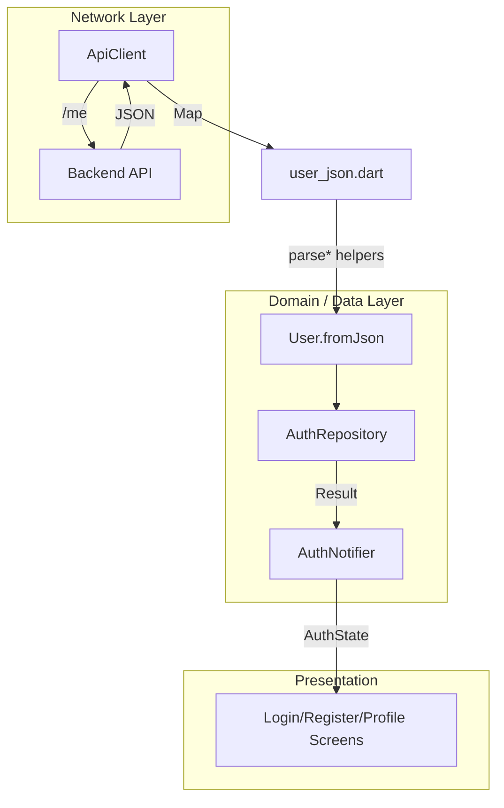

[EN](../en/User.md) | TR

# User Modülü

User modülü, authentication ile doğrudan ilişkili **çekirdek kullanıcı modelini** (`User`) ve ona bağlı yardımcı yapıları kapsar. Amaç:

- Backend Prisma şemasına **bire bir uyumlu**, tip güvenli bir `User` modeli sağlamak,
- Backend’teki JSON alan isimleri ve tutarsızlıkları (`id` vs `userId` gibi) merkezi bir yerde çözmek,
- User ile ilgili tüm tipleri tek bir barrel dosya üzerinden import edilebilir hale getirmek.

İlgili dokümanlar:
- Hata modeli ve Result tipi: [`ErrorHandling.md`](ErrorHandling.md)
- Auth akışı: [`Auth.md`](Auth.md)

---

## Contents

1. [Architecture](#architecture)
2. [File structure](#file-structure)
3. [Key concepts](#key-concepts)
4. [Usage](#usage)
5. [Developer guide](#developer-guide)
6. [Troubleshooting](#troubleshooting)
7. [References](#references)

---

## Architecture



Özet:

- Network katmanından gelen ham JSON, `user_json.dart` içindeki helper’lar ile güvenli şekilde parse edilir.
- Kritik alan eksiklikleri `ApiException` olarak fırlatılır, üst katmanda `ErrorMapper` ile `Failure`’a dönüştürülür.
- `User` ve `Profile` modelleri immutable, tip güvenli ve backend şemasına uyumludur.

---

## File structure

```text
lib/core/models/user/
├── models.dart          # Barrel export
├── user.dart            # Çekirdek User modeli (freezed)
├── user_extensions.dart # User için computed properties
├── user_json.dart       # JSON parsing helper’ları (id/email/flag/datetime)
├── profile.dart         # Profil modeli (extensible)
├── profile.freezed.dart # Generated (freezed)
├── profile.g.dart       # Generated (json_serializable)
└── user.freezed.dart    # Generated (freezed)
```

Genel kullanım için:

```dart
import 'package:flutter_frontend_boilerplate/core/models/user/models.dart';
```

---

## Key concepts

### Çekirdek User modeli

- **freezed** ile tanımlanmış immutable veri tipi.
- Sadece auth/core alanlarını içerir:
  - `id`, `email`
  - `emailVerified`, `isSuspended`
  - `lastLoginAt`, `createdAt`, `updatedAt`
- Custom `fromJson`, backend tutarsızlıklarını helper fonksiyonlara delege eder.

Basitleştirilmiş örnek:

```dart
// lib/core/models/user/user.dart
@freezed
class User with _$User {
  const User._();

  const factory User({
    required String id,
    required String email,
    @Default(false) bool emailVerified,
    @Default(false) bool isSuspended,
    DateTime? lastLoginAt,
    DateTime? createdAt,
    DateTime? updatedAt,
  }) = _User;

  factory User.fromJson(Map<String, dynamic> json) {
    return User(
      id: parseUserId(json),
      email: parseEmail(json),
      emailVerified: parseBool(json, 'emailVerified'),
      isSuspended: parseBool(json, 'isSuspended'),
      lastLoginAt: parseDateTime(json['lastLoginAt']),
      createdAt: parseDateTime(json['createdAt']),
      updatedAt: parseDateTime(json['updatedAt']),
    );
  }
}
```

### JSON helper’lar (`user_json.dart`)

- `parseUserId`: Backend hem `"id"` hem `"userId"` kullanabiliyorsa tek yerden yönetilir; alan yoksa `ApiException` fırlatır.
- `parseEmail`: `"email"` alanının varlığını ve tipini doğrular.
- `parseBool`, `parseDateTime`: boolean ve tarih alanları için ortak parse mantığını içerir.

### User extensions

`user_extensions.dart`, sık kullanılan durum kontrollerini extension olarak sunar:

- `isActive`: kullanıcı uygulamayı kullanabilir (suspended değil ve email doğrulanmış),
- `needsEmailVerification`,
- `isSuspendedAccount`.

Bu sayede auth flow’larındaki iş kuralları UI’dan ayrılır.

### Profile modeli

`profile.dart`, profil/sosyal alanlar için ayrı bir model sağlar:

- `User` sadece auth/core alanlarını taşır,
- Profil verileri (`displayName`, `avatarUrl`, `bio` vb.) `Profile` altında toplanır.

---

## Usage

### Tek import ile tüm modül

```dart
import 'package:flutter_frontend_boilerplate/core/models/user/models.dart';

void handleUser(User user) {
  if (user.isActive) {
    // normal akış
  } else if (user.needsEmailVerification) {
    // verify email ekranına yönlendir
  } else if (user.isSuspendedAccount) {
    // suspended account mesajı göster
  }
}
```

### Network’ten gelen JSON’u parse etme

```dart
final json = await apiClient.getMe();
final user = User.fromJson(json);
```

Detaylı error/exception akışı için [`ErrorHandling.md`](ErrorHandling.md) dokümanına bakın.

---

## Developer guide

### User modeline yeni alan ekleme

1. `user.dart` dosyasında `User` factory’sine yeni alanı ekleyin.
2. `fromJson` içinde bu alanı okuyup parse eden kodu ekleyin (gerekirse `user_json.dart` içine helper yazın).
3. `toJson`’da bu alanı serialize etmeyi unutmayın (manuel yazılmışsa).
4. Freezed/JSON codegen kullanıyorsanız `dart run build_runner build` çalıştırın.

### JSON parse kurallarını güncelleme

1. `user_json.dart` içindeki helper fonksiyonları güncelleyin veya yenilerini ekleyin.
2. Eksik/hatalı alanların gerçekten exception’a dönüşmesi gerekiyorsa, açıklayıcı bir mesajla `ApiException` fırlatın.
3. Bu exception'ı error handling katmanında uygun `Failure` tipine map edin (bkz. [`ErrorHandling.md`](ErrorHandling.md)).

### Profil verisini genişletme

1. `profile.dart` içinde yeni alanlar ekleyin.
2. Freezed/JSON codegen’ini yeniden çalıştırın.
3. `Profile`’ı repository ve notifier’larda `User` ile birlikte kullanın.

---

## Troubleshooting

- **User parsing runtime’da patlıyor**:
  - Backend’ten gelen JSON’un `user_json.dart` beklentileriyle uyumlu olduğundan emin olun.
- **Auth flow çalışıyor ama iş kuralları dağınık**:
  - Sık kullanılan kontrolleri (`isActive` vb.) extension’lara taşıyın.
- **Profil alanı değişince eski ekranlar bozuluyor**:
  - Auth/core alanları `User`, profil/sosyal alanları `Profile` içinde tutarak sorumlulukları ayırın.

---

## References

- User modeli: `lib/core/models/user/user.dart`
- JSON helper’lar: `lib/core/models/user/user_json.dart`
- Extensions: `lib/core/models/user/user_extensions.dart`
- Profil modeli: `lib/core/models/user/profile.dart`
- Barrel export: `lib/core/models/user/models.dart`

